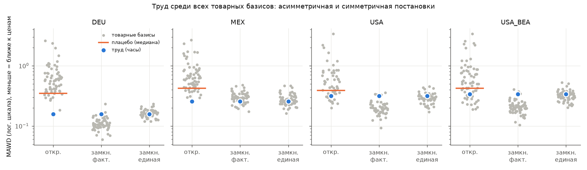
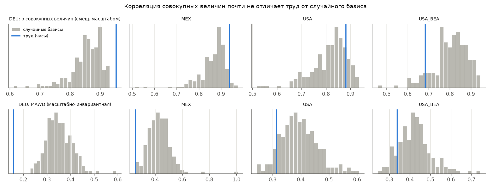
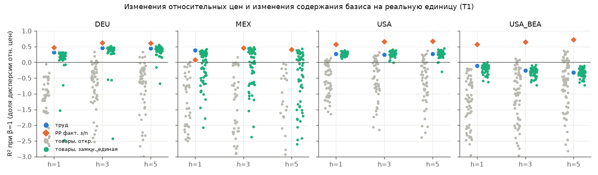

# Объясняет ли труд цены лучше альтернатив? Эмпирическая проверка ТТС на метриках, устойчивых к известной критике

*Данные: FIGARO 2010–2023 (США, Германия, Мексика + 10 стран для проверки устойчивости), BEA 1998–2023 (США). Весь код, таблицы и журнал допущений лежат в репозитории; каждое число ниже воспроизводится командами из README.*

## Коротко

1. **Стандартный результат воспроизводится.** Методика Zachariah (2006) на наших данных даёт для Германии 2010–2023 MAWD стоимостей 0,06–0,08 (у него для Германии 1990/1995 — 0,110/0,102), для США — 0,10–0,12 (у Шейха, 1998, для США 1947–72 — 0,07–0,105). Корреляция совокупных величин 0,97–0,99.
2. **Близость в основном создают методические выборы.** Если заменить прокси «оплата труда» на отработанные часы, MAWD вырастает примерно вдвое (Германия 0,07 → 0,15, США 0,11 → 0,25). Исключение «непроизводительных» отраслей снижает её ещё раз. В нашей базовой спецификации (часы, все отрасли, импорт по цене, амортизация) MAWD равна 0,16 (DEU), 0,26 (MEX), 0,32 (USA).
3. **Асимметрия встроена в метод (п. 1 уточнения).** В стандартной «открытой» постановке труд лучше 98–99% из 63 товарных базисов в Германии и Мексике и около 82% в США. Но там базис-товар считает труд бесплатным, а труд «оплачивает» все свои затраты. В симметричной замкнутой системе, где рабочая сила воспроизводится корзиной по **единой** ставке, труд попадает в середину распределения: лучше него 45% (DEU), 45% (MEX) и 65% (USA) товарных базисов. Электроэнергия с ним практически вровень.
4. **Динамика (п. 2).** Изменения содержания труда на реальную единицу выпуска объясняют заметную долю изменений относительных цен: R² при β=1 на «ядре» 0,24–0,73. Это лучше всех физических базисов в открытой системе и лучше 76–95% базисов в симметричной (кроме США по данным FIGARO), а в Германии — и лучше «чужих» часов (перестановок). Но это **не лучше**, чем у произвольного ресурса с фиксированной долей в номинальных затратах, и заметно хуже, чем у цен производства с фактическими зарплатами. В опережающих регрессиях (лаги 1–2) объяснительной силы нет ни у одного базиса.
5. **Вне выборки.** США (BEA): обучение 1998–2008, прогноз 2009–2014 и 2009–2023. На «ядре» труд лучше всех товарных базисов и 99% случайных плацебо и сравним с наивным прогнозом «цены не меняются» (RMSE 0,066 против 0,064); на длинном горизонте он лучше наивного (0,071 против 0,120). Цены производства с фактическими зарплатами лучше труда во всех странах, кроме Мексики.
6. **Информация сверх цен производства.** В охватывающей регрессии «труд против PP с фактическими зарплатами» вес труда ≈ 0 для Германии, США и BEA (от −0,04 до 0,13) и в уровнях, и в изменениях. Исключение — Мексика (вес 0,76–0,84 в изменениях), где сами PP менее надёжны: амортизация по отраслям заимствована у США.

Общий вывод: данные согласуются с тем, что **цены следуют издержкам производства**, а отработанное время — одна из хороших, но не особенных сводок этих издержек. При симметричной постановке мы **не нашли** свидетельств, что труд объясняет цены лучше любых альтернатив. В асимметричной (стандартной) постановке он лучше, но это преимущество в значительной мере создаёт сам метод.

## 1. Вопрос и почему прежние результаты его не решают

Высокие корреляции «стоимость — цена» (Shaikh, Ochoa, Cockshott & Cottrell, Zachariah; обзор в [`literature.md`](literature.md)) критикуют по четырём линиям:
- (а) эффект масштаба (Freeman 1998; Kliman 2002);
- (б) такие корреляции дала бы любая теория издержек, в том числе сраффианская;
- (в) редукция сложного труда через зарплаты делает расчёт круговым;
- (г) по обобщённой теореме об эксплуатации товаров любой базисный товар формально «эксплуатируется» так же, как труд.

Мы спрашиваем не «близки ли стоимости к ценам», а **лучше ли труд альтернатив** по метрикам, к этой критике устойчивым. Вслед за уточнением задачи основной упор сделан на: (1) симметрию построения трудового и альтернативных базисов, (2) динамику и прогноз вне выборки, (3) масштабно-инвариантные метрики везде, (4) объяснение расхождений в литературе.

## 2. Данные

WIOD 2016 недоступен (dataverse.nl отвечает автоматическим запросам «Access Denied», обходить не стали). Замена:
- **Eurostat FIGARO** (межстрановые таблицы «отрасль × отрасль», 64 отрасли, 2010–2024);
- **OECD National Accounts**: Table 7 — занятые и часы, Table 6 — амортизация P51C и дефляторы выпуска;
- **OECD TiMBC** — структура занятости по образованию;
- **BEA** — Make/Use 1997–2023, импортные матрицы, индексы цен выпуска, FTE из NIPA 6.5D.

Страны: США, Германия, Мексика; для проверки устойчивости — Франция, Италия, Испания, Нидерланды, Австрия, Польша, Чехия, Корея, Япония, Великобритания. Источники, URL, лицензии и контрольные суммы — в README и `data/raw/MANIFEST.csv`. Все решения, влияющие на результат, записаны в [`ASSUMPTIONS.md`](../ASSUMPTIONS.md). Ключевые из них:
- у США 11 отраслей объединены с «поглотителями», потому что OECD Table 7 не даёт по ним занятых;
- у Мексики нет амортизации по отраслям, поэтому отношения CFC/GOS взяты у США;
- в данных BEA у США нет часов по отраслям, поэтому использованы FTE.

## 3. Методы

**Единицы.** Единица продукта — 1 денежная единица выпуска, поэтому рыночная цена каждой отрасли равна 1. Объект анализа — отношение z_j = (содержание базиса на единицу выпуска) × e + (импортное содержание по цене). Скаляр e нормирует Σz_j x_j = Σx_j.

**Одна функция для всех базисов.** Для входной матрицы системы M и первичного ресурса с прямыми затратами a содержание равно λ = a(I − M₍ₖ₎)⁻¹, где M₍ₖ₎ — M с обнулённой строкой ресурса, который считается непроизводимым. Труд, товарные базисы, плацебо и замкнутые системы считаются одной и той же функцией `core.content`.

**Три системы.**
- *Открытая (стандарт литературы):* M = A (+D). Для трудового базиса все товары разлагаются на труд. Для товарного базиса k труд — бесплатный внешний ресурс. Это и есть асимметрия, о которой спрашивал п. 1.
- *Замкнутая с фактическими зарплатами:* к n товарам добавлены n «видов труда». Товар j требует h_j/x_j часов труда j, а час труда j требует потребительскую корзину домохозяйств стоимостью w_j (своей часовой оплаты). Теперь базис-товар учитывает себя и в корзине рабочих, а труд по-прежнему учитывает всё, что производится. Трудовой базис при этом не меняется (проверено тестом).
- *Замкнутая с единой ставкой:* та же корзина стоимостью w̄ на любой час. Этот вариант не использует межотраслевых различий в зарплатах, иначе товарные базисы получили бы информацию, которой нет у «часового» труда. Система продуктивна во всех страно-годах (ρ ≤ 0,94).

**Основной капитал.** D = b·d′: амортизация d_j (OECD P51C/P1) распределена по поставщикам в структуре ВНОК всей экономики. Матриц потоков капитала по отраслям в открытых данных нет.

**Импорт.** Три варианта: (i) по цене — отдельный непроизводимый ресурс; (ii) «конкурентный» — A + Aᵐ; (iii) MRIO — по содержанию труда или ресурса в стране-экспортёре через полную мировую матрицу FIGARO.

**Цены производства.** p = (1+r)(pM + Mᵐ) + w∘l, где r — фактическая норма прибыли на поток нетрудовых затрат. Варианты:
- `PP един.` — единая часовая ставка;
- `PP факт.` — фактические зарплаты, то есть сраффианская «цена издержек»;
- `PP eigen` — зарплата авансируется как корзина: p — собственный вектор (Перрона–Фробениуса) матрицы M + b·w′, r определяется реальной зарплатой.

**Редукция труда.** (а) часы; (б) часы × относительная зарплата — **потенциально круговой** вариант; (в) по образованию (OECD TiMBC; κ = S/9 или 1 + (S − 9)/40, где S — годы обучения).

**Метрики** (все масштабно-инвариантны): CV и взвешенный CV отношений z, MAD и MAWD отношений p/v, d-метрика Steedman–Tomkins √(2(1−cos θ)), взвешенное log-SD. Корреляции совокупных величин приводятся только для сравнения с литературой и помечены как смещённые масштабом.

**Плацебо** — проверка тезиса Климана «не лучше случайной переменной с тем же распределением»:
- 200 случайных первичных ресурсов с тем же лог-разбросом коэффициентов, что у прямых часов, фиксированных во времени для страны;
- 50 фиксированных перестановок вектора часов между отраслями;
- для уровней ещё и **все 52–68 отраслей как базисы**: это и есть распределение альтернатив.

**Динамика и круговость дефлятора.** Содержание базиса на реальную единицу равно z_j·P_j, поэтому регрессия Δlog P на Δlog(z·P) механически даёт положительный β: дефлятор стоит в обеих частях. Главная статистика **T1** этого избегает: R² = 1 − Var(Δlog z_rel)/Var(Δlog P_rel), то есть доля дисперсии изменений относительных цен, объясняемая изменением содержания базиса при эластичности, **зафиксированной на 1**. Отношение z считается только из таблиц в текущих ценах и часов, дефлятор входит только в знаменатель. Кроме того:
- **T2** — панельная регрессия с эффектами отраслей и лет, лаги 0–2; механическую часть калибруют плацебо;
- **T3** — охватывающие веса: min Var(Σw_B Δlog z^B) при Σw = 1;
- **T4** — вне выборки: эффекты отраслей оцениваются на обучающих годах, ошибка в тестовых годах сравнивается с наивным прогнозом «относительные цены заморожены»;
- **T5** — T3 для пары «труд против цен производства».

## 4. Результаты

### 4.1 Валидация

| | Опубликовано | Наши данные, та же методика |
|---|---|---|
| Zachariah (2006), Германия, MAWD LV / PP | 1990: 0,110 / 0,156; 1995: 0,102 / 0,143 | 2010–2023: 0,066 (0,059–0,078) / 0,072 |
| Shaikh (1998), США 1947–72, MAWD LV | 0,071–0,105 | методика Zachariah, США 2010–2023: 0,109 (0,096–0,121) |
| Cockshott & Cottrell (1997), UK 1984, CV «содержание x / цена» | труд 0,198; электроэнергия 3,69; нефть 11,4; сталь 7,8 | открытая система с капиталом, 2010–2023: труд 0,20 (DEU), 0,34 (MEX), 0,43 (USA); электроэнергия 0,53–0,79, нефтепродукты 0,81–0,85, металлы 0,91–1,59 (медиана всех товарных базисов 0,78–0,97) |

Порядок величин у Zachariah и Шейха воспроизводится. Превосходство труда по CV у нас в 2–4 раза, а не в 18–58 раз, как у Кокшотта–Коттрелла: у них нет амортизации, а данные UK 1984 и детализация другие. Большие отклонения в нашей основной спецификации объясняются тем, что мы используем часы, а не оплату (в той же методике «часы» дают 0,150 для Германии и 0,245 для США), и не исключаем отрасли. Технические проверки (`results/tables/validation_technical.csv`, 68 страно-лет: 42 FIGARO и 26 BEA):
- тождество по столбцам выполняется с точностью ≤ 4·10⁻⁴;
- ρ(A) = 0,26–0,56, ρ(A+Aᵐ+D) ≤ 0,70;
- (I−A)⁻¹ ≥ 0, диагональ ≥ 1, отрицательных коэффициентов нет;
- vy = lx с точностью до машинного нуля;
- обе замкнутые системы продуктивны (ρ ≤ 0,94).

Модуль ядра покрыт 18 юнит-тестами (`tests/test_core.py`).

### 4.2 Уровни: труд среди всех базисов

MAWD, все отрасли, импорт по цене, с амортизацией; средние за 2010–2023 (BEA — 1998–2023). «Доля лучше» — доля из 52–68 товарных базисов с меньшей MAWD, чем у труда (часы).

| Страна | Труд (часы) | Открытая: медиана товаров / доля лучше | Замкнутая, факт. з/п: медиана / доля | Замкнутая, единая з/п: медиана / доля | Случайные плацебо: 5-й перц. | PP един. / факт. з/п |
|---|---|---|---|---|---|---|
| DEU | 0,158 | 0,573 / 0,2 % | 0,104 / 95 % | 0,160 / 45 % | 0,271 | 0,113 / 0,082 |
| MEX | 0,255 | 0,616 / 0,7 % | 0,293 / 26 % | 0,262 / 45 % | 0,315 | 0,257 / 0,243 |
| USA (FIGARO) | 0,315 | 0,500 / 18 % | 0,195 / 93 % | 0,289 / 65 % | 0,301 | 0,200 / 0,127 |
| USA (BEA) | 0,339 | 0,512 / 26 % | 0,203 / 96 % | 0,318 / 68 % | 0,310 | 0,222 / 0,157 |

*Рис. 1. Серые точки — все товарные базисы, синяя — труд (часы), оранжевая линия — медиана случайных плацебо. В открытой системе труд лучше почти всех альтернатив. В симметричной замкнутой системе с единой ставкой он в середине распределения.*

По d-метрике картина та же (`results/report_tables.md`). Открытая система: доля лучших товаров 0% (DEU), 0,3% (MEX), 27% (USA). Замкнутая с единой ставкой: 37%, 42%, 64%. Именованные «физические» базисы (электроэнергия, нефтепродукты, металлы, сельское хозяйство) в открытой системе по MAWD в 2–12 раз хуже труда. В симметричной системе электроэнергия почти равна труду (DEU 0,162 против 0,158; MEX 0,285 против 0,255) или лучше (USA 0,234 против 0,315). Лучшие базисы в замкнутой системе — «широкие» услуги (строительство, финансы, деловые услуги), которые почти пропорционально входят во все отрасли.

Относительно случайных плацебо (критика Климана) труд в Германии и Мексике лучше 95% случайных базисов, а в США — на границе 5-го перцентиля (0,315 против 0,301). Тезис «не лучше случайной переменной» для масштабно-инвариантных метрик **не подтверждается** в Германии и Мексике и **подтверждается** для США.

### 4.3 Редукция труда (критика (в))

MAWD, открытая система с капиталом:

| | Часы | Взвешено по з/п (круговой вариант) | Образование (κ = S/9) |
|---|---|---|---|
| DEU | 0,158 | 0,094 | 0,156 |
| MEX | 0,255 | 0,303 | 0,251 |
| USA | 0,315 | 0,200 | 0,313 |
| USA (BEA) | 0,339 | 0,212 | 0,342 |

Взвешивание по зарплате заметно «улучшает» совпадение в Германии и США, то есть там заметная часть известной близости стоимостей и цен — это близость **фонда оплаты труда** к ценам. Некруговая редукция по образованию почти ничего не меняет: образовательная структура отраслей слишком похожа, чтобы объяснить межотраслевые различия в зарплатах. В Мексике зарплатная редукция ухудшает совпадение (высокая неформальность; условная оплата самозанятых). Вывод: результаты, полученные на прокси «оплата труда» (Zachariah 2006, Tsoulfidis & Rieu 2006, Fröhlich), нельзя считать проверкой трудовой теории в узком смысле.

### 4.4 Эффект масштаба (критика (а))

Открытая система с капиталом, средние по годам:

| | ρ совокупных величин: труд / медиана плацебо | ρ после поправки на размер (деление на нетрудовые затраты): труд / плацебо | CV: труд / плацебо | d: труд / плацебо |
|---|---|---|---|---|
| DEU | 0,953 / 0,864 | 0,913 / 0,245 | 0,198 / 0,443 | 0,181 / 0,370 |
| MEX | 0,937 / 0,878 | 0,838 / 0,342 | 0,336 / 0,490 | 0,303 / 0,422 |
| USA | 0,881 / 0,829 | 0,483 / 0,150 | 0,433 / 0,515 | 0,338 / 0,369 |
| USA (BEA) | 0,683 / 0,814 | 0,454 / 0,177 | 0,578 / 0,556 | 0,293 / 0,382 |

*Рис. 2. Случайный базис с тем же разбросом коэффициентов даёт корреляцию совокупных величин 0,81–0,88. Отличие труда видно только в масштабно-инвариантных метриках, и оно существенно меньше, чем подсказывает «0,95».*

Критика (а) по существу верна: корреляции совокупных величин почти ничего не говорят. Но **вывод Климана «после поправки на размер связь исчезает» воспроизводится только частично.** С поправкой на размер отрасли (деление на нетрудовые затраты) у труда остаётся ρ = 0,45–0,91 против 0,15–0,34 у плацебо.

### 4.5 Импорт

Способ учёта импорта для трудового базиса почти не важен. MAWD (открытая, с капиталом), «по цене» против «конкурентного»: DEU 0,158 против 0,168, MEX 0,255 против 0,269, USA 0,315 против 0,321. В варианте MRIO (все страны в занятых, без капитала) MAWD 0,235 / 0,396 / 0,338 против 0,243 / 0,386 / 0,367 в национальном расчёте на том же векторе занятых. Для товарных базисов MRIO тоже почти ничего не меняет.

### 4.6 Динамика: изменения относительных цен (T1, T2)

T1 — R² при β=1, взвешено по выпуску; открытая система с капиталом, «ядро» (без добычи, финансов, недвижимости и госсектора); h = горизонт разности в годах.

| | Труд, h=1 / h=5 | PP факт. з/п | Товары (откр.): медиана | Товары (замкн., единая): доля лучше труда | Перестановки часов: медиана / доля лучше | Фикс. номинальный ресурс: медиана |
|---|---|---|---|---|---|---|
| DEU | 0,34 / 0,54 | 0,49 / 0,69 | < 0 | 8 % / 24 % | 0,19–0,44 / 8–14 % | 0,61–0,72 |
| MEX | 0,59 / 0,68 | 0,10 / 0,59 | < 0 | 5 % | 0,47–0,52 / 2–10 % | 0,78–0,79 |
| USA (FIGARO) | 0,24 / 0,36 | 0,67 / 0,82 | < 0 | 80 % | 0,29–0,49 / 68–92 % | 0,73–0,77 |
| USA (BEA) | 0,46 / 0,73 | 0,59 / 0,82 | < 0 | 9–15 % | 0,20–0,38 / 0–4 % | 0,53–0,72 |

*Рис. 3. T1 на всех отраслях (для BEA на всех отраслях R² труда < 0: доминируют ценовые шоки добычи и недвижимости). Цветные точки — товарные базисы в открытой (серые) и замкнутой с единой ставкой (бирюзовые) системах.*

Что видно:
1. Изменения часов на реальную единицу **действительно связаны** с изменениями относительных цен. На «ядре» R² 0,24–0,73. Физические базисы в открытой системе дают отрицательные R², а перестановки часов между отраслями (правильный нуль «цены не связаны с часами своей отрасли») в Германии, Мексике и BEA-США заметно хуже труда. Этот тест в пользу ТТС в смысле «трудоёмкость → цена», хотя и с эластичностью заметно ниже 1.
2. Этого **недостаточно, чтобы отличить ТТС от теорий издержек.** Ресурс со случайной, но фиксированной долей в номинальных затратах объясняет динамику лучше труда (R² 0,53–0,79): стабильность номинальных долей затрат — сильная регулярность сама по себе. Цены производства с фактическими зарплатами лучше труда везде, кроме Мексики.
3. На **всех** отраслях труд в США проигрывает и плацебо, и наивному «нулю» (R² < 0 в BEA). Динамика цен добычи, недвижимости и финансов не имеет ничего общего с динамикой часов.
4. **T2 (регрессии).** С лагом 0 β труда = 0,48 (SE 0,15, BEA), R² 0,39, но у фиксированных случайных плацебо R² = 0,57 (медиана), а у перестановок 0,48: это механическая компонента общего дефлятора. С лагами 1–2 R² ≤ 0,07 у всех базисов, включая плацебо, то есть **опережающей** силы у изменений трудоёмкости нет.

### 4.7 Горс-рейс и информация сверх цен производства (T3, T5)

Охватывающий вес труда (Σw = 1; w = 1 — труд охватывает альтернативу, w = 0 — альтернатива охватывает труд). Открытая система с капиталом, «ядро»:

| | vs электроэнергия: изм. / уровни | vs нефтепродукты: изм. / уровни | vs PP факт. з/п: изм. / уровни | vs PP един. з/п: изм. / уровни |
|---|---|---|---|---|
| DEU | 0,90 / 0,90 | 1,02 / 0,91 | −0,04 / 0,18 | −0,11 / −0,29 |
| MEX | 0,83 / 0,79 | 0,90 / 0,81 | 0,84 / 0,49 | 0,28 / 0,38 |
| USA (FIGARO) | 0,73 / 0,70 | 0,79 / 0,82 | 0,02 / 0,00 | −0,85 / −0,62 |
| USA (BEA) | 1,02 / 0,82 | 1,03 / 0,88 | 0,13 / 0,11 | 1,19 / −0,08 |

В открытой системе труд охватывает энергетические базисы. В замкнутой системе с единой ставкой электроэнергия получает вес 0,35–0,78 в уровнях, а в США больше 1 (см. `report_tables.md`). **Сверх цен производства с фактическими зарплатами труд информации почти не добавляет** в Германии и США (вес 0–0,18). Цены производства с единой ставкой — это «трудовые стоимости + поправка на капиталоёмкость»; в уровнях они охватывают стоимости (вес труда < 0), в изменениях результат смешанный.

### 4.8 Вне выборки (T4)

RMSE лог-отклонения относительной цены в тестовые годы; модель — «отношение базис/цена постоянно для отрасли» (эффекты оценены на обучающих годах). Открытая система с капиталом, «ядро».

| Данные, тест | Труд | PP един. | PP факт. | Товары, медиана | Случайные плацебо, медиана | Перестановки, медиана | Наивный (цены заморожены) |
|---|---|---|---|---|---|---|---|
| BEA, обучение 1998–2008 → 2009–2014 | **0,066** | 0,081 | 0,048 | 0,140 | 0,080 | 0,114 | 0,064 |
| BEA, 1998–2008 → 2009–2023 | **0,071** | 0,084 | 0,061 | 0,186 | 0,092 | 0,132 | 0,120 |
| DEU, 2010–2016 → 2017–2023 | 0,070 | 0,061 | 0,052 | 0,101 | 0,051 | 0,075 | 0,110 |
| MEX, 2010–2016 → 2017–2023 | 0,062 | 0,050 | 0,066 | 0,243 | 0,048 | 0,081 | 0,121 |
| USA (FIGARO), 2010–2016 → 2017–2023 | 0,094 | 0,073 | 0,043 | 0,113 | 0,059 | 0,085 | 0,099 |

Здесь сделан тест, которого в литературе мы не нашли: прогноз относительных цен на 6–15 лет вперёд. Трудовые «якоря» обыгрывают наивный прогноз на длинном горизонте в BEA-США, Германии и Мексике и обыгрывают все физические базисы. На длинном ряде США (BEA) труд лучше медианы случайных плацебо, а на коротких рядах FIGARO — нет. Цены производства с фактическими зарплатами — лучший предиктор, кроме Мексики. Ограничение: прогноз условен, так как использует фактическую технологию тестовых лет (z_t). Это проверка структурной связи «содержание базиса → цена», а не безусловный прогноз.

### 4.9 Устойчивость

Исключение секторов (MAWD, с капиталом; открытая / замкнутая с единой ставкой; «доля лучше» — товарные базисы лучше труда):

| | Все | Без добычи, финансов, недвижимости | Без госсектора | «Ядро» |
|---|---|---|---|---|
| DEU | 0,158 (0 % / 45 %) | 0,132 (0 % / 39 %) | 0,159 (0 % / 37 %) | 0,132 (1 % / 34 %) |
| MEX | 0,255 (1 % / 45 %) | 0,189 (0 % / 38 %) | 0,268 (4 % / 54 %) | 0,197 (0 % / 56 %) |
| USA | 0,315 (18 % / 65 %) | 0,248 (9 % / 66 %) | 0,335 (27 % / 62 %) | 0,289 (30 % / 68 %) |
| USA (BEA) | 0,339 (26 % / 68 %) | 0,209 (6 % / 54 %) | 0,372 (35 % / 68 %) | 0,216 (11 % / 56 %) |

Исключение добычи, финансов и недвижимости (включая условную ренту) заметно снижает MAWD. Позиция труда среди базисов качественно не меняется: в открытой системе он в лидерах, в симметричной — в середине.

<!-- ROBUST_COUNTRIES -->

### 4.10 Обобщённая «эксплуатация» (критика (г))

Замкнутая система, конкурентный импорт. Для **каждого** товарного базиса k содержание k в единице самого k меньше единицы: «норма эксплуатации k» e(k) = 1/λᵏₖ − 1 > 0 для 100% товаров во всех странах. Минимум e(k) — 1,9 (DEU), 0,9 (MEX), 1,2 (USA); медиана — 6,5 / 32 / 9,2. «Норма эксплуатации» труда (норма прибавочной стоимости: часы / часы, воплощённые в корзине) составляет 0,66 (DEU), 2,0 (MEX), 0,74 (USA), 0,60 (BEA). Теорема Ремера — Боулза–Гинтиса в данных выполняется тривиально. По этому формальному критерию труд не выделяется, а если выделяется, то **меньшей**, а не большей «эксплуатируемостью».

## 5. Что данные позволяют и чего не позволяют утверждать

| Критика | Позволяют утверждать | Не позволяют утверждать |
|---|---|---|
| **(а) масштаб** | Корреляции совокупных величин неинформативны: случайный базис даёт 0,81–0,88. На масштабно-инвариантных метриках труд в Германии и Мексике лучше 95% случайных базисов, в США — на границе. С поправкой на размер корреляция труда 0,45–0,91 против 0,15–0,34 у плацебо: «исчезновения» связи (Kliman 2002) мы не находим | что корреляции 0,95+ из литературы доказывают что-либо сверх отсутствия огромных разрывов между ценами и издержками |
| **(б) любая теория издержек** | Цены производства с фактическими зарплатами ближе к рыночным ценам, чем стоимости, и в уровнях, и в изменениях, и вне выборки (кроме Мексики). Сверх них труд информации почти не добавляет. Базис с фиксированной номинальной долей затрат объясняет динамику цен не хуже труда | что труд объясняет цены лучше **теорий издержек**. Данные говорят скорее обратное |
| **(в) круговая редукция** | Взвешивание по зарплате заметно улучшает совпадение (DEU 0,158 → 0,094; USA 0,315 → 0,200). Значит, часть «эмпирической силы» ТТС в литературе — это близость фонда оплаты к ценам. Некруговая редукция по образованию почти ничего не меняет | ни какова «правильная» редукция, ни что расхождение часов и оплаты — ошибка измерения часов |
| **(г) эксплуатация товаров / симметрия** | Стандартное превосходство труда над энергией, нефтью и металлами (Cockshott & Cottrell 1997) — в заметной мере артефакт асимметричной постановки. При симметричном замыкании труд попадает в середину распределения из 52–68 базисов. В динамике на «ядре» Германии, Мексики и BEA-США труд лучше 76–95% симметричных товарных базисов | что труд «такой же», как любой товар, во всех смыслах: в динамике у него остаётся преимущество над большинством товарных базисов и над «чужими» часами |

## 6. Что эта работа НЕ доказывает

* **Особый онтологический статус труда** в смысле теоремы об эксплуатации товаров. Мы проверяем предсказательную силу базисов для цен. Вопрос «что является субстанцией стоимости» — философский; эмпирическое сравнение базисов его не решает ни в одну сторону.
* **Ложность ТТС.** То, что цены лучше описываются издержками с фактическими зарплатами и прибылью, согласуется с марксовой теорией цен производства как формы проявления стоимости. Наши тесты отличают «стоимости как предиктор цен» от «издержек как предиктора цен». Мы не проверяем, распределяется ли прибавочная стоимость в масштабе всей экономики. Инвариантности преобразования мы тоже не проверяем.
* **Нормативные выводы.** Ни о справедливости распределения, ни об эксплуатации в этическом смысле, ни о желательности плановой экономики на трудовых ценах.
* **Причинность.** Все связи корреляционные. Опережающих эффектов изменений трудоёмкости на цены (лаги 1–2 года) мы не нашли. Условный прогноз вне выборки использует фактическую технологию тестовых лет.
* **Результаты для «физических» единиц.** Мы работаем с отраслями и денежными единицами выпуска. Данных о физических количествах нет, и агрегирование (52–69 отраслей) скрывает внутриотраслевую неоднородность цен.
* **Универсальность.** Три основные страны и 10 для проверки устойчивости — не выборка всех экономик. У Мексики существенно хуже данные (амортизация заимствована, часы восстановлены из грубых группировок).

## 7. Ограничения и чувствительность

* Нет WIOD. Для 2000–2008 есть только США (BEA); сравнение «2000–2008 → 2009–2014» сделано только на них.
* Основной капитал учтён как поток (D = b·d′), без матриц запасов и времени оборота (Шейх, Очоа). Нормы прибыли на запас мы не считаем. Результаты сильно зависят от учёта капитала: без него MAWD труда почти вдвое выше (0,34 / 0,52 / 0,48), и это главный фактор после меры труда.
* Часы восстановлены с допущениями (A-HOURS, A-MERGE, A-BEA-L). Для США в FIGARO плацебо-перестановки в динамике часто лучше истинных часов: это похоже на шум в отраслевых часах после перевода NAICS → ISIC → FIGARO. BEA-ряд (FTE по NAICS) от этой проблемы свободнее и даёт более «трудовую» картину.
* Замкнутая система использует корзину домохозяйств в целом (включая потребление из прибыли) как корзину рабочих.
* Цены производства с фактическими зарплатами используют номинальные данные тех же лет. Их преимущество частично отражает близость к учётным тождествам, поэтому как «тест сраффианской теории» оно слабее, чем выглядит.

## 8. Воспроизводимость

`README.md` — команды. `results/report_tables.md` — все таблицы, из которых взяты числа выше (средние по годам). `results/tables/*.csv` — метрики по годам, тесты T1–T4, валидация. Случайность — только в плацебо, с фиксированным зерном. `pytest` — 18 тестов ядра.
