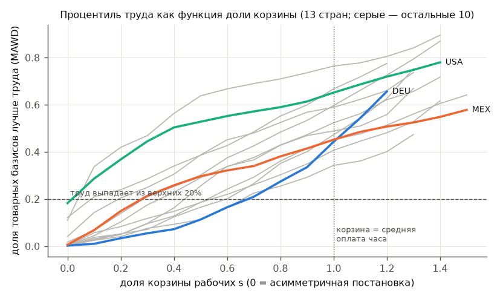
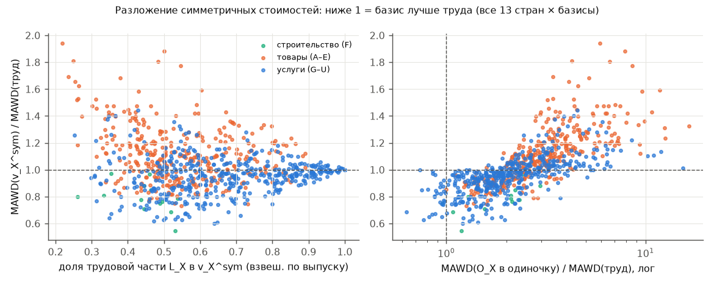
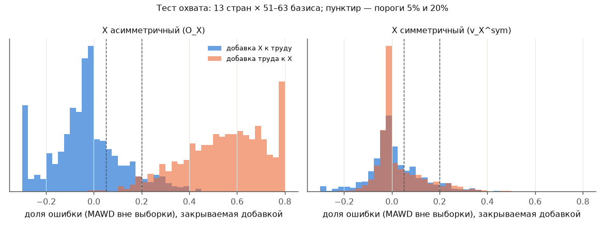
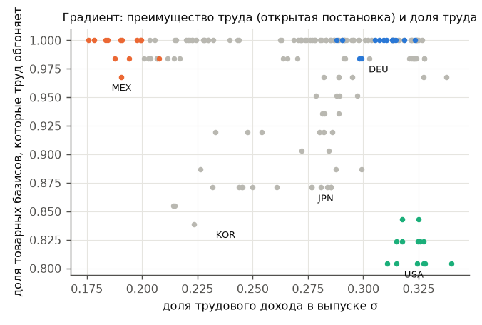

# Итерация 2: выдерживает ли вывод первой итерации самые сильные возражения?

*Предрегистрация — [`pre_registration_v2.md`](../pre_registration_v2.md). Коммиты 95177db, 413469f и 706e61b сделаны до соответствующих расчётов; изменения критериев перечислены в её журнале. Допущения — [`ASSUMPTIONS.md`](../ASSUMPTIONS.md), раздел «Итерация 2». Все числа — из `results/v2/*.csv`, команды — в README.*

## 0. Что проверялось и итог в одном абзаце

Проверялся вывод C первой итерации: «особость труда создаётся асимметрией метода; труд — хорошая сводка издержек, но не особенный фактор цен». Итог:
- **Вычислительная часть подтверждена независимо.** Отдельная реализация совпала с исходной точно.
- **Сильная формулировка C не выдерживает проверки.** В симметричной постановке труд действительно оказывается «в середине». Но разложение показывает, что обгоняющие его базисы — в основном «универсальные» услуги (не более трудоёмкие, чем остальные базисы), чья симметричная стоимость на 50–70% состоит из трудовой части. Собственное содержание этих базисов (O_X) всегда хуже труда и **ни в одной стране** не добавляет к трудовым стоимостям значимой информации вне выборки. Поэтому ничья в симметричном тесте — во многом ничья «труда» с «трудом плюс X». Кроме того, вывод зависит от размера корзины рабочих.
- **Остальная часть C подтверждается:**
  - цены производства превосходят трудовые стоимости и при единой (марксовой) ставке зарплаты;
  - редукция сложного труда без зарплат не закрывает разрыв с фондом оплаты;
  - особой роли долгосрочного аттрактора у труда нет;
  - улучшения данных результаты не меняют.

**Уточнённый вывод C′.** Среди «ресурсных» базисов труд доминирует: он охватывает все товарные базисы, а они его — нет. Однако от издержек производства он не отделим: цены производства (в том числе марксовы) систематически лучше. Симметричный тест не различает «особость» труда и его роль крупнейшей и самой универсальной издержки. Какая постановка правильна — асимметричная или симметричная, — вопрос теоретический, эмпирически он не решается (§3.3).

## 1. Что изменилось относительно первой итерации

| | Итерация 1 | Итерация 2 |
|---|---|---|
| Симметричный тест | одна реализация, одна корзина | независимая реализация (отдельный агент, код первой итерации не видел); 6 вариантов корзины и шкала s = 0…1,5; точное разложение v_X^sym = O_X + L_X |
| Сравнение с альтернативами | доля базисов лучше труда | + тест охвата вне выборки (бутстреп, 1000 перевыборок, BH), доли закрываемой ошибки, 1000 плацебо с долей затрат труда, градиент по доле труда |
| Цены производства | фактические зарплаты + единая ставка (без акцента) | (а) фактические, (б) единая ставка за час, (в) единая ставка за час, приведённый по квалификации без зарплат |
| Редукция труда | TiMBC, две схемы | + EU KLEMS (часы по образованию, DEU), сетка Кокшотта из 36 параметризаций, доля закрытого разрыва G |
| Долгий период | нет | ADF, тест Фишера, ECM (две спецификации), периоды полураспада |
| Данные | FTE (BEA), упрощённая амортизация | + часы BLS, матрица потоков капитала BEA 1997; Мексика исключена из выводов о PP; WIOD по-прежнему недоступен |

## 2. Этап 1. Независимая проверка симметричного теста

### 2.1 Независимая реализация

Отдельный агент реализовал тест по математической спецификации ([`independent/SPEC.md`](../independent/SPEC.md)), не видя кода первой итерации. Замкнутую систему он считал в другой, «свёрнутой» форме (Mc = M + β·ωᵀ), а равенство трудовых стоимостей проверял в «развёрнутой» (2n × 2n). Сравнение по 252 ячейкам (3 страны × 14 лет × 2 × 3 постановки):
- метрики труда совпали до 3·10⁻¹⁶;
- в открытой системе доли «лучше труда» совпали точно;
- в замкнутых системах в отдельные годы расхождение достигало 1,3 п.п. (в средних по годам — ≤ 1 п.п.).

Причина найдена: в свёрнутой форме у T («домохозяйства как работодатели») строка затрат становится ненулевой, и T попадает в число базисов (63 вместо 62). С одинаковым набором базисов расхождение **ровно 0** во всех ячейках. Классификацию «особый / середина» это не меняет.

### 2.2 Проверки корректности

У независимой реализации все проверки проходят во всех 252 спецификациях:
- спектральный радиус каждой системы ≤ 0,79;
- (I − S)⁻¹ ≥ 0, диагональ ≥ 1;
- трудовой базис в замкнутой системе совпадает со стандартным (1,8·10⁻¹⁵);
- собственная строка каждого базиса обнулена;
- восстановление матриц DEU и USA 2015 прямо из FIGARO совпадает с исходными до 10⁻¹¹.

### 2.3 Варианты корзины рабочих

Доля 51–63 товарных базисов, которые лучше труда (капитал, все отрасли, средние по годам; MAWD / d):

| Корзина | DEU | MEX | USA (FIGARO) | USA (BEA) |
|---|---|---|---|---|
| (а) фактические ставки | 95% / 83% | 26% / 45% | 93% / 99% | 96% / 95% |
| (а) единая ставка (итерация 1) | 45% / 37% | 45% / 42% | 65% / 64% | 68% / 62% |
| (б) физически фиксированная корзина базового года | 35% / 31% | 42% / 40% | 64% / 64% | 65% / 61% |
| (в1) только необходимые блага, весь доход | 35% / 30% | 27% / 27% | 63% / 64% | 59% / 59% |
| (в2) только необходимые блага, фактический объём (35–54% дохода) | **4% / 4%** | 17% / 18% | 39% / 53% | 44% / 40% |
| (г) с госуслугами («социальная зарплата») | 64% / 65% | 52% / 48% | 74% / 70% | 77% / 66% |



*Процентиль труда как функция доли корзины s. При s = 0 постановка асимметричная, при s = 1 корзина равна средней оплате часа. Показаны точки, допустимые (система продуктивна) не менее чем в половине лет.*

По критериям предрегистрации это **«зависит от корзины»**. В варианте (в2) — физиологическом минимуме необходимых благ — труд в Германии снова «особый» (4%). Порог s*, при котором труд выпадает из верхних 20%, в 13 странах составляет:

| s* | Страны |
|---|---|
| 0,1 | JPN, KOR, USA |
| 0,2 | NLD |
| 0,3 | GBR, MEX |
| 0,4 | ESP |
| 0,5 | FRA |
| 0,6 | AUT, CZE, POL |
| 0,7 | DEU, ITA |

Критерий 1.3б по странам распадается: порог s* < 0,5 (труд «особый» только при малой корзине) — в 7 странах, s* ∈ [0,5; 1] — в 6.

### 2.4 Какая корзина обоснована и что сказал бы Кокшотт

Это теоретический вопрос; эмпирически он не решается. Позиции такие:
- **У Маркса** стоимость рабочей силы — это стоимость средств существования, включая «исторический и моральный элемент». Это ближе к (а) или (б), то есть к корзине, равной реальной зарплате, чем к физиологическому минимуму (в2).
- **Корзина (г)** содержит блага, которые рабочий не покупает на зарплату, поэтому к стоимости рабочей силы в строгом смысле не относится.
- **Кокшотт и Коттрелл** исходят из того, что рабочая сила не производится капиталистически: домашний труд не продаётся, и нормы прибыли на воспроизводство людей нет. Для них открытая постановка — не асимметрия метода, а содержательная предпосылка: первичен именно труд, потому что его «производство» лежит вне товарного обращения. В этой логике «особость» труда в асимметричном тесте — следствие предпосылки, а не эмпирическое открытие. Мы проверили, что она **не** следует из самих данных: при s ≥ 0,1–0,7 товарные базисы догоняют труд. Но доказать, что предпосылка неверна, данные тоже не могут.

## 3. Этап 1б. Разложение симметричных стоимостей

### 3.1 Точное разложение

Вывод — в [`methods_decomposition.md`](methods_decomposition.md). По формуле Шермана–Моррисона

```
v_X^sym = O_X + θ_X · v₍ₖ₎,     θ_X = (b_k + O_X·b₍ₖ₎) / (1 − φ),     φ = v₍ₖ₎·b₍ₖ₎.
```

Проверки:
- O_X + L_X совпадает с прямым расчётом с относительной ошибкой ≤ 2,6·10⁻¹⁵ (13 стран × 13 лет × ≈62 базиса);
- φ ≤ 0,61 (на воспроизводство одного часа уходит не больше 0,61 часа, воплощённого в корзине);
- трудовые стоимости «без X как затраты» v₍ₖ₎ близки к стандартным v: корреляция ≥ 0,97, медиана максимального отклонения 8%, максимум 74% (для ключевых сырьевых X).

### 3.2 Доли, качество частей, кто обгоняет труд



Средние по годам, пары «страна × базис»: лучше труда 414 из 796 (52%).

| | Базисы лучше труда (симметр.) | Базисы хуже |
|---|---|---|
| Доля трудовой части L_X (медиана) | 61% | 56% |
| MAWD O_X в одиночку (медиана) против MAWD труда (0,215) | 0,38 (в 1,8 раза хуже) | 0,69 (в 3,2 раза хуже) |
| Тип | 72% услуги, 24% товары, 3% строительство | 62% товары, 38% услуги |
| Прямая трудоёмкость (медиана, ч на млн евро) | 13 200 | 12 700 |

Устойчиво обгоняют труд почти во всех 13 странах: мебель и прочая обработка (C31_32), строительство (F), издательская деятельность (J58), недвижимость (L), финансы (K64), образование (P85), юридические и управленческие услуги (M69_70), ИТ (J62_63), страхование (K65), НИОКР (M72), гостиницы и общепит (I), административные услуги (N80-82). Это «универсальные» затраты, которые почти пропорционально входят во все отрасли. «Физических» сырьевых базисов среди них нет.

Правый график показывает: симметричная X-стоимость бывает лучше трудовой только там, где O_X в одиночку не слишком плох (в пределах ~1–3 MAWD труда). Качество v_X^sym складывается из трудовой части и собственной, причём собственная часть всегда хуже труда.

### 3.3 Добавляет ли X что-то к труду

Бутстреп вне выборки (1000 перевыборок отраслей, поправка BH по 51–63 базисам в каждой стране):
- смесь «труд + O_X» значимо лучше труда — **0 из 795** пар «страна × базис»;
- смесь значимо лучше O_X (труд добавляет к X) — **60%** пар;
- медианная доля ошибки труда, закрытая добавкой O_X, — −3% (вне выборки добавка в среднем ухудшает прогноз).

### 3.4 Вывод по предрегистрированным критериям

Критерий выполнен, если он выполнен в ≥ 9 из 13 стран.

| Критерий | Страны, где выполнен | Выполнен? |
|---|---|---|
| P1: доля L_X у обгоняющих > 60% | 7 из 13 | нет |
| P2: O_X хуже труда у ≥ 80% обгоняющих | 12 из 13 (кроме USA — 69%) | **да** |
| P3: смесь значимо лучше труда у < 25% базисов | 13 из 13 (везде 0%) | **да** |
| P4: труд выпадает из верхних 20% лишь при s ≥ 0,7 | 2 из 13 | нет |
| P5: ≥ 60% обгоняющих — услуги | 13 из 13 (62–82%) | **да** |
| O1: O_X в пределах 10% от труда у ≥ 20% базисов | 1 из 13 (USA) | нет |
| O2: смесь значимо лучше у ≥ 25% физических базисов | 0 из 13 | нет |
| O3: s* ≤ 0,3 | 6 из 13 | нет |
| O4: ≥ 60% обгоняющих — товары или строительство | 0 из 13 | нет |

**Исход по правилу — «смешанный»:** 3 из 5 критериев P, 0 из 4 критериев O, со смещением в сторону аргумента сторонников ТТС.

**Эмпирически:** ни один товар не несёт информации о ценах сверх труда. Симметричные базисы обгоняют труд за счёт того, что сами наполовину и больше состоят из труда, и за счёт «универсальности» (это в основном услуги). Но труд теряет верхние позиции уже при корзине 10–30% от средней зарплаты в 6 странах, то есть задолго до фактической корзины.

**Интерпретация (отдельно от эмпирики).** Возражение «симметричный тест сравнивает труд с трудом плюс X» в существенной мере подтверждается. Одновременно отсутствие добавки от X совместимо и с теорией издержек производства: нетрудовые издержки в IO-таблицах сами разложимы на труд, поэтому их содержание почти коллинеарно трудовому.

## 4. Этап 1в. Принципиально ли лучше труд

### 4.1 Охват и размер эффекта



Ошибка — MAWD вне выборки. «Добавка X» — доля ошибки труда, которую закрывает X; «добавка труда» — доля ошибки X, которую закрывает труд. 795 пар «страна × базис».

| | Добавка X < 5% | Добавка X ≥ 20% | Добавка труда > 20% | «Труд доминирует» (обе части) | X значимо добавляет | Труд значимо добавляет |
|---|---|---|---|---|---|---|
| Асимметричный X | 77% | 7% (товары 0,6%; строительство 23%; услуги 12%) | 97% | **75%** | 0% | 60% |
| Симметричный X | 72% | 7% | 8% | 8% | 4% | 0% |

- **Асимметричная постановка.** Труд охватывает все товарные базисы, а они его — нет. Критерий «доминирует» (≥ 90% пар) почти достигнут (75%), поэтому по правилу это «промежуточно». Не доминирует он в основном в США и Японии и для строительства и отдельных услуг.
- **Симметричная постановка.** Взаимный охват: X^sym и труд почти взаимозаменяемы, медианные добавки в обе стороны ≈ 0. Это ожидаемо из разложения §3.

### 4.2 Плацебо с той же долей затрат

1000 ресурсов из долей случайных товаров, в сумме равных доле трудового дохода в выпуске (19–32%). Доля плацебо, которые лучше труда (MAWD / d):

| Результат | Страны (MAWD / d) |
|---|---|
| Труд в верхних 5% по обеим метрикам (7 стран) | AUT 0 / 0%, CZE 4 / 0%, DEU 0 / 0%, ESP 0 / 0%, FRA 0 / 0%, ITA 0 / 0%, MEX 0,2 / 0% |
| Не в верхних 5% хотя бы по одной метрике (6 стран) | NLD 0 / 60%, POL 0 / 17%, KOR 4 / 8%, GBR 92 / 60%, JPN 8 / 100%, USA 100 / 100% |

Критерий «преимущество не объясняется долей затрат» (≥ 10 из 13) не выполнен; «объясняется» (≥ 7 из 13 с долей > 5%) — тоже нет (6 стран). Исход — **«частично»**.

- Динамика (T1): в Германии и Мексике труд лучше 90–100% плацебо, в США — хуже 93–100%.
- Вне выборки: в Мексике труд лучше всех плацебо, в Германии хуже 99%, в США хуже 26%.

Такие плацебо вынуждены включать почти все товары: их распределение по отраслям **равномернее** трудового (CV 0,2–0,4 против ~0,56 у труда). Поэтому «универсальных» плацебо с разбросом, как у труда, почти нет (0–35 из 5000). Сама эта «универсальность» и есть то, чем широкие нетрудовые издержки похожи на труд.

### 4.3 Градиент по доле труда



- **Регрессия** доли базисов, которые труд обгоняет (асимметричная постановка), на долю трудового дохода σ, 169 страно-лет:
  - с эффектами стран и лет: β = 0,27 (SE 0,27, p = 0,31);
  - межстрановая: β = −0,27 (p = 0,49);
  - эффект межквартильного размаха σ — около 2 п.п.
- **Отрасли:** в трудоёмкой половине преимущество труда выше, чем в капиталоёмкой, во всех 13 странах, на ≥ 10 п.п. в 7 из них.
- **По критериям — «неопределённо».** Регрессии незначимы (в пользу особого статуса), но adv опускается до 0,80 (USA), а внутри стран есть заметный отраслевой градиент (в пользу трактовки «труд как крупнейшая издержка»). Межстрановой разброс σ мал (межквартильный размах 8 п.п.), поэтому мощность теста низкая.

## 5. Этап 2. Цены производства с единой ставкой зарплаты

MAWD (капитал, все отрасли / «ядро»):

| | Труд (часы) | PP (а) факт. | PP (б) единая за час | PP (в) единая за приведённый час (образование) | PP (в) Кокшотт |
|---|---|---|---|---|---|
| DEU | 0,158 / 0,132 | 0,082 / 0,061 | 0,126 / 0,106 | 0,116 / 0,096 | 0,122 / 0,104 |
| USA (FIGARO) | 0,315 / 0,289 | 0,127 / 0,061 | 0,226 / 0,213 | 0,224 / 0,204 | 0,225 / 0,211 |
| USA (BEA) | 0,339 / 0,216 | 0,157 / 0,113 | 0,244 / 0,178 | 0,243 / 0,172 | 0,243 / 0,176 |
| MEX (справочно) | 0,255 / 0,197 | 0,243 / 0,212 | 0,268 / 0,184 | 0,252 / 0,185 | 0,264 / 0,184 |

Проверка критериев («ядро»; Мексика исключена из выводов о PP, A-DATA-V2-MEX):
- **T1 (R² при β=1):** PP (б) лучше труда в DEU (0,37 против 0,34 при h = 1; 0,61 против 0,54 при h = 5), USA (0,45 против 0,24) и MEX (0,64 против 0,59), но хуже в BEA (0,36 против 0,46). Итого 3 из 4.
- **T4 (RMSE вне выборки):** PP (б) лучше в DEU (0,061 против 0,070), USA (0,073 против 0,094) и MEX (0,050 против 0,062), хуже в BEA (0,081 против 0,066). Итого 3 из 4.
- **T5 (вес труда против PP (б)):** DEU −0,11 / −0,29; USA −0,85 / −0,62; BEA 1,19 / −0,08; MEX 0,28 / 0,38 (изменения / уровни). Вес ≤ 0,3 в 6 из 8 ячеек.

**Вывод по критерию:** преимущество PP над трудом **сохраняется** при единой ставке (б) и при квалификационной (в). Оно меньше, чем с фактическими зарплатами, но есть во всех трёх наборах данных по уровням и в большинстве динамических тестов. Исключение — длинный ряд BEA, где в динамике и вне выборки лучше труд.

**Интерпретация.** PP (б) — это трудовые стоимости плюс поправка на капиталоёмкость (норма прибыли на авансированный капитал), то есть марксово «превращение». Преимущество PP (б) над стоимостями **согласуется с Марксом** (цены производства как регулятор рыночных цен) и не свидетельствует против трудовой теории в марксовой форме. Против «простой» трудовой теории, где цены пропорциональны стоимостям, оно свидетельствует.

## 6. Этап 3. Редукция сложного труда без зарплат

G — доля разрыва «часы → фонд оплаты», которую закрывает редукция (MAWD / d, все отрасли):

| | Разрыв MAWD (часы → фонд оплаты) | Образование (κ = S/9) | Кокшотт, центр | Кокшотт, диапазон по 36 параметризациям (MAWD) |
|---|---|---|---|---|
| DEU (EU KLEMS) | 0,158 → 0,094 | 0,06 / 0,09 | 0,02 / 0,03 | 0,007–0,030 |
| USA (TiMBC) | 0,315 → 0,200 | 0,01 / 0,04 | 0,00 / 0,01 | 0,002–0,006 |
| USA (BEA) | 0,339 → 0,212 | −0,03 / 0,04 | −0,01 / 0,01 | −0,008 до −0,002 |
| MEX | разрыв ≈ 0 (фонд оплаты не лучше часов) | не определено | — | — |

На «ядре» G до 0,13 (BEA, образование). **Во всех вариантах G ≤ 0,2 — круговость не снимается.** Редукция по образованию и времени обучения почти не меняет трудовые стоимости: образовательная структура отраслей различается слабо, а формула Кокшотта даёт множители не больше ~1,2. Межотраслевые различия в оплате, которые «улучшают» совпадение, этими факторами не объясняются. Это может означать либо что зарплатные различия несут рыночную (ренты, переговорная сила), а не квалификационную информацию, либо что грубые данные об образовании (3 уровня, 17–21 агрегат) не видят реальной квалификации. Разделить эти объяснения мы не можем.

## 7. Этап 4. Долгосрочное притяжение

Модель B: Δlog P_rel = α_j + ρ·отклонение_{t−1}; модель A добавляет Δlog B^phys (механически связана с ценой, см. журнал предрегистрации). Спецификация — «ядро».

| | T | ADF: доля отраслей со стационарным отклонением (10%) / Фишер p | ρ_B труда (полураспад, лет) | ρ_B: PP (а) / (б) | ρ_A: труд / PP (а) / PP (б) | Быстрее труда (B): открытые товары / симметр. товары / перестановки / фикс. номин. |
|---|---|---|---|---|---|---|
| DEU | 14 | 17% / 0,000 | −0,13 (5,1) | −0,15 / −0,13 | −0,29 / −0,37 / −0,33 | 0% / 23% / 14% / 62% |
| USA (FIGARO) | 14 | 12% / 0,013 | −0,14 (4,8) | −0,24 / −0,15 | −0,22 / −0,36 / −0,25 | 0% / 51% / 2% / 34% |
| USA (BEA) | 26 | 9% / 0,049 | −0,04 (16) | −0,01 / −0,01 | −0,14 / −0,15 / −0,12 | 0% / 16% / 0% / 0% |
| MEX (справочно) | 14 | 13% / 0,061 | −0,10 (6,5) | −0,02 / −0,06 | −0,25 / −0,23 / −0,26 | 0% / 2% / 0% / 0% |

**По критерию:** особым аттрактором труд **не является**. В модели A цены производства (а) возвращают цены быстрее труда во всех трёх наборах, в модели B — в двух из трёх (кроме BEA). Симметричные товарные базисы быстрее труда в 16–51% случаев.

Труд — надёжнее открытых товарных базисов и перестановок часов, то есть отклонения от него действительно корректируются, хотя медленно: полураспад 5 лет на FIGARO и ~16 лет на BEA. Это согласуется с C («хорошая сводка издержек»).

Мощность низкая: доля отраслей, где единичный корень отвергается, — 9–17%, почти номинальный уровень, хотя совместный тест Фишера значим. Выводы о стационарности отклонений по отдельным отраслям делать нельзя.

## 8. Этап 5. Улучшение данных

США, BEA 1998–2023, средние по годам, все отрасли (в скобках — «ядро»):

| Вариант | MAWD труда | Доля лучше труда: открытая (MAWD / d) | Доля лучше труда: симметричная (MAWD / d) | PP (а) / PP (б) |
|---|---|---|---|---|
| base (итерация 1) | 0,339 (0,216) | 26% / 13% | 68% / 62% | 0,157 / 0,244 |
| часы BLS | 0,331 (0,208) | 25% / 13% | 66% / 62% | 0,157 / 0,243 |
| потоки капитала 1997 | 0,335 (0,216) | 18% / 5% | 63% / 53% | 0,154 / 0,241 |
| BLS + потоки капитала | 0,327 (0,208) | 17% / 5% | 61% / 53% | 0,154 / 0,241 |

- **Часы BLS** покрывают 34 отрасли и 29% часов; результаты меняются меньше чем на 2 п.п.
- **Матрица потоков капитала** сдвигает процентиль труда на 8–9 п.п. в пользу труда в обеих постановках — чуть ниже порога 10 п.п. Знак сравнения PP с трудом не меняется. По критерию — **«устойчиво»**, но близко к порогу. Учёт основного капитала остаётся самым чувствительным элементом данных.
- **WIOD** — не проверено: доступ закрыт (BotStopper); файлы можно положить вручную в `data/raw/wiod/`.
- **INEGI** — машиночитаемой отраслевой амортизации не получено (API 403); Мексика исключена из выводов о ценах производства (§5, §7).

## 9. Сводка

| Результат итерации 1 | Статус | Где проверено |
|---|---|---|
| R1: MAWD при часах ≈ вдвое выше, чем при фонде оплаты | **подтвердился** (G ≤ 0,13; круговость не снимается) | §6 |
| R2: в асимметричной постановке труд в верхнем дециле, в симметричной — в середине | **вычислительно подтвердился, по смыслу ослаб**: зависит от корзины (s* = 0,1–0,7); симметричная ничья — во многом «труд против труда + X» | §2, §3, §4.1 |
| R3: труд лучше 95% случайных базисов (DEU, MEX) | **подтвердился для DEU и MEX**; против плацебо с долей затрат труда — «частично» (7 из 13 стран) | §4.2 |
| R4: в динамике труд не лучше ресурса с фиксированной долей и хуже PP | **подтвердился**, в том числе для PP с единой ставкой (кроме BEA) | §4.2, §5 |
| R5: вне выборки PP лучше труда | **подтвердился** для PP (а) везде и для PP (б) в 3 из 4 | §5 |
| R6: вес труда против PP ≈ 0 | **подтвердился** против PP (а) и в основном против PP (б) (6 из 8) | §5 |
| R7: теорема об эксплуатации товаров выполняется | **подтвердился** (тривиально) | итерация 1 |
| Дополнительно: особый долгосрочный аттрактор | **не обнаружен** | §7 |
| Дополнительно: устойчивость к данным | **устойчиво** (часы BLS; потоки капитала — на грани порога) | §8 |

**1. Выдерживает ли главный вывод независимую проверку и варианты корзины?** Вычисления — да, точно. Сильная формулировка («особость создаётся асимметрией») — нет. Она зависит от корзины и от того, считать ли «ничью» с базисами, которые наполовину состоят из труда, ничьей. Собственное содержание ни одного товара не добавляет информации к труду. В асимметричной постановке труд охватывает все базисы (доминирование по порогам — у 75% пар). Корректная формулировка — C′ из §0.

**2. Сохраняется ли превосходство цен производства при единой ставке зарплаты?** Да, в уровнях, в 3 из 4 динамических тестов и вне выборки. Оно меньше, чем с фактическими зарплатами. Это превосходство марксовых цен производства над «простыми» стоимостями, а не теории издержек над Марксом.

**3. Снимает ли редукция без зарплат упрёк в круговости?** Нет: G ≤ 0,13 при любой параметризации.

**4. Есть ли у трудовых стоимостей особая роль долгосрочного аттрактора?** Нет. Отклонения цен от трудовых стоимостей корректируются (полураспад 5–16 лет) надёжнее, чем от физических базисов и «чужих» часов, но не быстрее, чем от цен производства.

## 10. Что эта работа НЕ доказывает

* **Что асимметричная постановка ошибочна или верна.** Это вопрос теории: производится ли рабочая сила как товар. Мы показали, как результат зависит от ответа, но не выбираем ответ.
* **Особый онтологический статус труда** в смысле теоремы об эксплуатации товаров. Доминирование труда в асимметричном тесте — это предсказательное свойство, а не доказательство того, что стоимость — «сгусток труда».
* **Опровержение Маркса.** Главные эмпирические результаты — PP лучше стоимостей, особого аттрактора нет, рыночные зарплаты «улучшают» совпадение — совместимы с марксовой теорией цен производства. Они говорят против «простой» трудовой теории (цены ∝ стоимостям) и против утверждения, что труд объясняет цены лучше любых издержек.
* **Причинность.** Все результаты — корреляционные и условные: прогноз вне выборки использует фактическую технологию тестовых лет. Опережающей силы изменений трудоёмкости нет.
* **Нормативные выводы** — о справедливости распределения, эксплуатации в этическом смысле, экономическом планировании.
* **Результаты для физических единиц и мелких отраслей.** Анализ ведётся на 51–69 отраслях в денежных единицах выпуска.

## 11. Ограничения

* Короткие ряды: FIGARO 13–14 лет, BEA 26. Тесты единичного корня маломощны.
* Амортизация: либо структура ВНОК всей экономики, либо матрица потоков капитала 1997 года для всех лет. Запасов капитала и времени оборота нет, поэтому норма прибыли считается на поток.
* Данные об образовании грубые: 3 уровня; EU KLEMS по отраслям — только для Германии из основных стран.
* Мексика: амортизация по отраслям заимствована у США; выводы о ценах производства по ней не делаются.
* Корзина рабочих = структура потребления **всех** домохозяйств (включая потребление из прибыли); отдельных данных о потреблении рабочих нет.
* Независимая реализация проверяет вычислительный слой; слой подготовки данных (часы, объединения, амортизация) у реализаций общий. Отдельно проверено только восстановление матриц IO из FIGARO.
