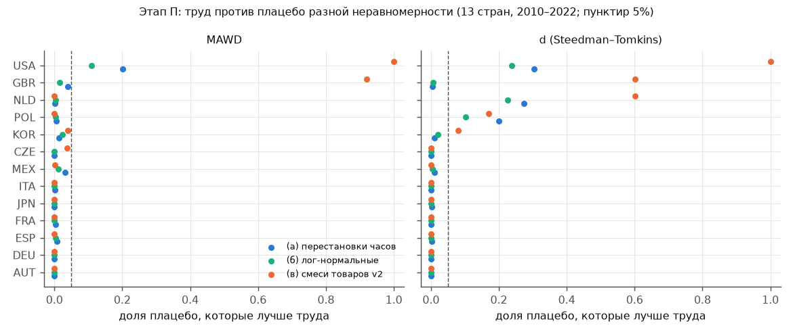
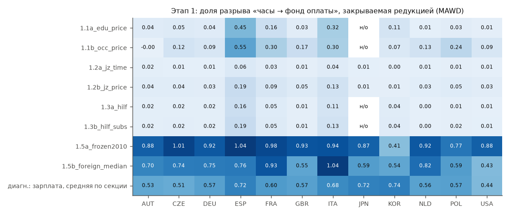
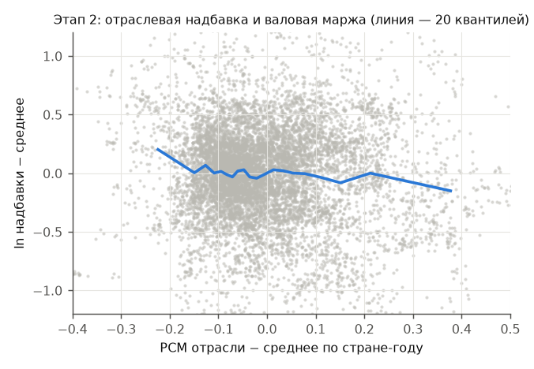
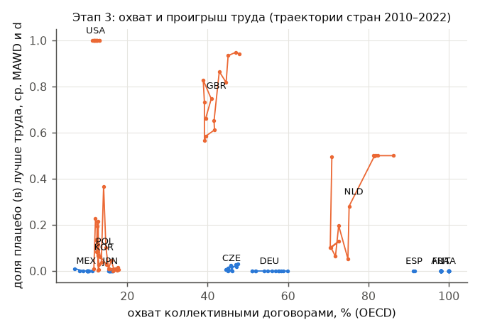

# Трудовая теория стоимости на таблицах «затраты — выпуск»: итерация 3

Предрегистрация: [`pre_registration_v3.md`](../pre_registration_v3.md) (коммиты 653f7f8 и 09a3b0d сделаны до расчётов; журнал изменений — в конце файла). Все таблицы: [`results/v3/tables_v3.md`](../results/v3/tables_v3.md). Предыдущие отчёты: [`REPORT.md`](REPORT.md), [`REPORT_v2.md`](REPORT_v2.md).

> **Исправления после независимой рецензии (§11) и итерации 4 ([REPORT_v4.md](REPORT_v4.md)).** Главное:
> 1. Исход этапа П («10 из 13») стоит ровно на пороге и **не устойчив**. При разбивке занятости без денежных данных страны или без разбитых отраслей (итерация 4, А1) получается 9 из 13, итог — **«промежуточно»**. Он же опускается до 9 при других равноправных решениях: занятые KOR из STAN, импорт как конкурирующий.
> 2. «Плоский» вектор, одинаковый для всех отраслей на единицу выпуска и не несущий никакой информации об отраслях, лучше часов по MAWD в 12 из 13 стран, по d — в 10–11. Выигрыш труда против плацебо той же формы значит только одно: **при заданном разбросе** ранжирование часов согласовано с ценами. Безусловно часы хуже вектора без информации.
> 3. Сжатие разброса часов без всяких данных о зарплатах (l^0,5) закрывает 80–120% разрыва «часы — фонд оплаты». Поэтому G этапа 1 измеряет в основном сжатие разброса. Вывод §7.4 о «информации зарплат» не доказан, а H(1) для 1.2a выполнялся механически.
> 4. Знак связи надбавки с прибыльностью (2a) зависит от нормировки: на выпуск −0,28, на час +0,06 (p = 0,03). Тест 2b механически гарантирует значимость x1. Панель этапа 3 почти лишена мощности. Итог по H смягчён: **«не подтверждается»** вместо «опровергается».
> 5. Проигрыш США на данных BEA держится только по MAWD; по d доля плацебо лучше 0,05 / 0,03. Проигрыш POL по d создаёт в основном одна отрасль N78 (38% вклада в d), вероятно, из-за артефакта учёта.
>
> Ниже в тексте исправлены только фактические неточности. Прежние формулировки выводов оставлены, чтобы было видно, что изменилось.

## Резюме

1. **Плацебо v2 были нечестно равномерными (этап П).** Против плацебо той же неравномерности, что у часов (перестановки часов и лог-нормальные с тем же разбросом), труд в верхних 5% по обеим метрикам в **10 из 13** стран. Предрегистрированный порог ≥ 10 означает: «провал в v2 объясняется равномерностью плацебо». Этот исход держится на исправлении данных Японии (п. 2); без него было бы 9 из 13, то есть «промежуточно». Труд остаётся хуже части плацебо в **США** (на FIGARO по обеим метрикам; на независимых данных BEA — только по MAWD, по d доля 0,05 / 0,03), а также в **Нидерландах и Польше** (только по d).
2. **Найдена ошибка данных для Японии.** OECD публикует для Японии D вместе с E, M вместе с N и R вместе с S и T под одноимёнными кодами. Девять японских отраслей получали 0 занятых. После исправления Япония из «проигрывающих» стала «выигрывающей» против всех типов плацебо. Это меняет и результаты итераций 1–2 по Японии (§5.1).
3. **Редукция без отраслевых зарплат почти не закрывает разрыв «часы — фонд оплаты» (этап 1).** Образование или профессия по единой национальной цене, O*NET Job Zones и полные издержки обучения по Гильфердингу закрывают в медиане 1–13% разрыва по MAWD, категория «мало» во всех вариантах. Отраслевая структура зарплат **других** стран (медиана по 12 странам) закрывает 72% (медиана по MAWD). Отраслевые различия оплаты в основном общие для стран, но не объясняются измеренной квалификацией. Оговорка: данные о квалификации есть только на уровне секций ISIC; даже фактическая зарплата, усреднённая до секций, закрывает лишь 57% (§3.3).
4. **Отраслевая надбавка не связана с прибыльностью положительно (этап 2).** Связь надбавки с валовой маржой отрицательная: β = −0,28, p = 0,03; положительна только в 4 странах из 13. Как регрессор надбавка значима, но её уникальный вклад ≥ 50% только в 1 стране из 13.
5. **Ни один из пяти кандидатов не объясняет проигрыш труда внутри стран (этап 3).** Панель с эффектами страны и года, дикий кластерный бутстреп, поправка Холма: все p_Holm = 1,0 для основной зависимой переменной. Между странами охват коллективными договорами связан с выигрышем труда (ρ = −0,60, перестановочное p = 0,03). Но это 13 наблюдений, группы были известны заранее, и после поправки Холма (0,15) связь незначима.
6. **Рабочая гипотеза H по предрегистрированному правилу опровергается** (§6). Этап 2 против H, а главные кандидаты К1 и К5 не значимы в основном тесте даже без поправки. Звено «разрыв — не квалификация» выдержало проверку. Звено «надбавки — это ренты, разделённые с работниками» — нет.

## 1. Что изменилось по сравнению с v2

| | v2 | v3 |
|---|---|---|
| Плацебо | смеси товаров с долей затрат труда (13 стран) | + перестановки часов и лог-нормальные с разбросом часов, по 1000, для 13 стран; исключения отраслей |
| Япония | 9 отраслей без занятых (ошибка чтения кодов OECD) | исправлено (A-JPN-SECT) |
| Редукция | годы обучения (TiMBC), сетка Кокшотта: G ≤ 0,13 | 8 вариантов без отраслевых зарплат страны + диагностика «потолка» на уровне секций |
| Новые данные | — | ILOSTAT (структура профессий, заработки по ISCO), OECD EAG (заработки по образованию), Eurostat SES 2018, O*NET 29.0 Job Zones, таблицы соответствия SOC 2018 ↔ SOC 2010 ↔ ISCO-08 (BLS), OEWS 2022, OECD UOE (число учащихся), OECD CBC (охват коллективными договорами), население (World Bank) |
| Не удалось получить | — | EWCS (Eurofound отвечает 429; микроданные — после регистрации в UK Data Service), ICTWSS «уровень переговоров» (oecd.org за Cloudflare), WIOD (см. итерацию 1) |

Первичная спецификация как в v2: открытая система, капитал учтён (A⁺ = A + D), импорт по цене, оценка без T и U, 13 стран FIGARO, 2010–2022, средние по годам, метрики MAWD и d.

## 2. Этап П: плацебо с той же неравномерностью, что у труда

**Зачем.** При цене отрасли = 1 ресурс, пропорциональный добавленной стоимости, совпадает с ценами идеально. Плацебо v2 («смеси товаров») распределены по отраслям равномернее труда (CV 0,2–0,4 против ~0,56) и поэтому ближе к добавленной стоимости. Проигрыш им мог быть артефактом.

**Типы плацебо** (по 1000, фиксированы для страны во времени):

* (а) перестановки вектора прямых часов на единицу выпуска между оцениваемыми отраслями — ровно то же распределение коэффициентов;
* (б) лог-нормальные коэффициенты с тем же лог-разбросом, что у часов в этом году;
* (в) смеси товаров v2, пересчитанные тем же кодом. Для 2010 года совпадение с v2 проверено до знака (USA и NLD, MAWD и d).

**Таблица 1.** Доля плацебо, которые лучше труда (часов), среднее за 2010–2022 (после исправления Японии).

| страна | (а) MAWD | (а) d | (б) MAWD | (б) d | (в) MAWD | (в) d | верхние 5% против (а) и (б) | против (в) |
|---|---|---|---|---|---|---|---|---|
| AUT | 0,00 | 0,00 | 0,00 | 0,00 | 0,00 | 0,00 | да | да |
| CZE | 0,00 | 0,00 | 0,00 | 0,00 | 0,04 | 0,00 | да | да |
| DEU | 0,00 | 0,00 | 0,00 | 0,00 | 0,00 | 0,00 | да | да |
| ESP | 0,01 | 0,00 | 0,00 | 0,00 | 0,00 | 0,00 | да | да |
| FRA | 0,00 | 0,00 | 0,00 | 0,00 | 0,00 | 0,00 | да | да |
| GBR | 0,04 | 0,00 | 0,02 | 0,01 | 0,92 | 0,60 | да | нет |
| ITA | 0,00 | 0,00 | 0,00 | 0,00 | 0,00 | 0,00 | да | да |
| JPN | 0,00 | 0,00 | 0,00 | 0,00 | 0,00 | 0,00 | да | да |
| KOR | 0,02 | 0,01 | 0,02 | 0,02 | 0,04 | 0,08 | да | нет |
| MEX | 0,03 | 0,01 | 0,01 | 0,00 | 0,00 | 0,00 | да | да |
| NLD | 0,00 | 0,27 | 0,00 | 0,23 | 0,00 | 0,60 | нет (d) | нет (d) |
| POL | 0,01 | 0,20 | 0,00 | 0,10 | 0,00 | 0,17 | нет (d) | нет (d) |
| USA | 0,20 | 0,30 | 0,11 | 0,24 | 1,00 | 1,00 | нет | нет |



**Результат (эмпирически).**

* Против (а) и (б) труд в верхних 5% в **10 из 13** стран. Не проходят NLD и POL — только по d; по MAWD 0–1%. Не проходят и USA — по обеим метрикам.
* До исправления Японии было 9 из 13: Япония проигрывала по d, доля плацебо лучше 0,90–0,98. Японский «проигрыш» создавали отрасли с нулевыми часами, у которых 1/z очень велико (до ≈ 11). Невзвешенная d-метрика к таким точкам особенно чувствительна.
* Против (в) после исправления в верхних 5% **8 из 13** (в v2 было 7).
* GBR и KOR проигрывают только равномерным плацебо (в). Это ровно тот случай, который предрегистрация выделила для диагностики П4.

**П4. Какие отрасли дают расхождение.** Доля отрасли в MAWD труда (среднее по годам):

* GBR: недвижимость L — 27%, K64 — 11%, K65 — 7%;
* KOR: L — 14%, C26 (электроника) — 11%, K64 — 8%;
* NLD: K64 — 21%, B (добыча газа) — 12%, L — 8%;
* POL: L — 20%, G46 — 10%, A01 — 8%;
* USA: L — 30%, M69_70 (право, бухгалтерия) — 13%, K64 — 6%.

Во всех случаях это отрасли, где доля в добавленной стоимости многократно превышает долю в часах. Например, L в USA: 12% добавленной стоимости при 1% часов. Там z ≈ 0,5.

После исключения **заранее заданного** набора (B, K64–66, L, J61, J62_63):

* GBR и KOR попадают в верхние 5% и против (в). У GBR по d остаётся 0,06, то есть на грани.
* NLD — в верхних 5% против всех трёх типов.
* POL по d остаётся вне (0,12–0,21).
* USA по MAWD проходит (а) и (б) (0,04), но по d нет (0,33–0,39).

Разведочное исключение трёх отраслей с наибольшим вкладом (у всех 13 стран среди них L и/или K64) даёт похожую картину.

**Проверка США на независимом источнике** (BEA, 69 отраслей, часы FTE, 2010–2022). Доля плацебо лучше труда по MAWD: (а) 0,38, (б) 0,19, (в) 1,00; по d: 0,05, 0,03, 0,98. Без B/K/L/J61–63 по MAWD: 0,001 / 0,002 / 0,50. Проигрыш США не создан слиянием отраслей в FIGARO. Он создаётся в основном отраслями ренты и финансов.

**Вывод по предрегистрации П:** ≥ 10 стран → «провал в v2 объясняется равномерностью плацебо». Оговорка: исход держится на исправлении Японии (без него 9 → «промежуточно») и на трёх странах, где проигрыш реален (USA) или зависит от метрики (NLD, POL).

## 3. Этап 1: редукция без отраслевых зарплат

### 3.1 Варианты

Все варианты — веса отраслей, умножаемые на часы.

| Код | Вес | Источник | Медиана лог-SD веса | Корр. с ln отраслевой зарплаты |
|---|---|---|---|---|
| 1.1a | заработок уровня образования по единой национальной цене (EAG; FRA — SES 2018) × доли уровней в отрасли (TiMBC) | OECD | 0,07 | 0,35 |
| 1.1b | национальный заработок основной группы ISCO × структура профессий секции | ILOSTAT | 0,14 | 0,49 |
| 1.2a | 1 + время подготовки (O*NET Job Zone) × 1600 / (40 · 1800) | O*NET, BLS, ILOSTAT | 0,01 | 0,40 |
| 1.2b | exp(β · время подготовки), β — отдача года обучения из EAG | то же + EAG | 0,04 | 0,40 |
| 1.3a | 1 + годы обучения сверх 9 × (1600 ч учёбы + E) / (40 · 1800); E — вертикально интегрированный труд образования на учащегося в год (USA 315 ч, DEU 250, NLD 204, MEX 127 в 2015) | IO + UOE | 0,02 | 0,37 |
| 1.3b | 1.3a + трудовое содержание потребления на душу за год учёбы | + World Bank | 0,02 | 0,37 |
| 1.5a | собственная относительная почасовая оплата отраслей 2010 года, заморожена (оценка 2011–2022) | FIGARO | 0,44 | 0,97 |
| 1.5b | медиана относительной почасовой оплаты отрасли по 12 **другим** странам | FIGARO | 0,35 | 0,74 |

Для сравнения: фонд оплаты (фактическая почасовая оплата) — лог-SD 0,44.

Соответствие O*NET-SOC → SOC 2018 → SOC 2010 → ISCO-08 с весами занятости OEWS 2022 сохранено в `results/v3/crosswalk_soc2018_soc2010_isco08_jobzone.csv`. Среднее время подготовки по группам ISCO: руководители 3,1 года, специалисты 3,4, техники 2,0, … неквалифицированные 0,8.

Для JPN нет долей образования по отраслям (ни в TiMBC, ни в ILOSTAT) и нет заработков по профессиям. Поэтому 1.1a, 1.1b, 1.3a, 1.3b для JPN — «н/д». Вариант 1.4 (интенсивность, EWCS) не выполнен: данные недоступны.

### 3.2 Закрытие разрыва

G = (err_часы − err_редукция) / (err_часы − err_фонд). Для MEX G не определён: фонд оплаты не лучше часов (0,302 против 0,256 по MAWD).



**Таблица 2.** Итог по вариантам (12 стран с определённым G).

| Вариант | Медиана G, MAWD | Стран «мало / частично / существенно / почти» (MAWD) | Медиана G, d | То же (d) | Категория |
|---|---|---|---|---|---|
| 1.1a образование, единая цена | 0,04 | 9/2/0/0 | 0,10 | 11/0/0/0 | **мало** |
| 1.1b профессия, единая цена | 0,13 | 8/2/1/0 | 0,17 | 7/4/0/0 | **мало** |
| 1.2a Job Zone, время | 0,01 | 12/0/0/0 | 0,01 | 12/0/0/0 | **мало** |
| 1.2b Job Zone, отдача | 0,04 | 12/0/0/0 | 0,05 | 12/0/0/0 | **мало** |
| 1.3a Гильфердинг | 0,02 | 11/0/0/0 | 0,03 | 11/0/0/0 | **мало** |
| 1.3b Гильфердинг + содержание | 0,02 | 11/0/0/0 | 0,04 | 11/0/0/0 | **мало** |
| 1.5a свои зарплаты 2010, заморожены | 0,92 | 0/1/1/10 | 0,88 | 0/1/1/10 | почти полностью |
| 1.5b зарплаты других стран | 0,72 | 0/1/8/3 | 0,69 | 2/2/5/3 | существенно |
| *диагностика: своя зарплата, средняя по секции* | 0,57 | 0/1/11/0 | 0,51 | 2/3/7/0 | *существенно* |

Чувствительность задана заранее: часы учёбы {1000, 1600, 2000}, трудовая жизнь {35, 40, 45}, JZ5 {4, 5, 6}, SES вместо EAG. Максимальный G по сетке и всем странам: 1.2a — 0,10, 1.2b — 0,20, 1.3a — 0,22, 1.3b — 0,25. Категория «мало» не меняется. Наибольшие значения в Испании и Италии: там отраслевые различия в образовании сильнее.

Процентиль труда среди товарных базисов (открытая постановка) при всех вариантах 1.1–1.3 почти тот же, что у часов. USA: 16–19% базисов лучше по MAWD при 18% у часов. KOR: 9–12% при 12%. NLD по d: 13–17% при 18%. Остальные страны: ≤ 6%.

### 3.3 Оговорка о разрешении (не предрегистрирована, диагностика)

Данные о квалификации есть на уровне секций ISIC (ILOSTAT) или 17 агрегатов (TiMBC), а фонд оплаты различается по 64 отраслям. Чтобы понять, сколько разрыва вообще может закрыть вес, меняющийся только между секциями, мы подставили **фактическую** зарплату страны, усреднённую до секции. Она закрывает в медиане 57% разрыва по MAWD (44–74%) и 51% по d.

Отсюда:

* около 40–45% разрыва лежит внутри секций и недоступно нашим мерам квалификации;
* но и доступную межсекционную часть меры квалификации почти не используют: 1.1b закрывает 13% при потолке 57%.

Вывод «квалификация, измеренная так, объясняет мало» устойчив. Вывод «квалификация вообще объясняет мало» этим не доказан.

## 4. Этап 2: отраслевая надбавка

W_j = H_j · q_j · ω · (1 + π_j), где q — веса 1.1a (для JPN — 1.2b). Разброс надбавки почти равен разбросу зарплаты: взвешенная по часам SD ln надбавки 0,24–0,57 против 0,27–0,60 у ln почасовой оплаты. Квалификация «снимает» лишь малую часть отраслевого разброса.

**2a. Надбавка и прибыльность** (10 322 наблюдения «отрасль × страна × год»; эффекты страна × год; веса выпуска; SE кластеризованы по отраслям):

| Показатель | β | SE | p |
|---|---|---|---|
| PCM = (ДС − D1) / выпуск (первичный) | −0,279 | 0,128 | 0,029 |
| PCM по трудовому доходу | −0,122 | 0,144 | 0,40 |
| NOS / CFC | −0,012 | 0,006 | 0,064 |

Средняя по годам корреляция надбавки с PCM внутри страны положительна только в FRA, JPN, NLD, USA (0,01–0,09). В AUT, ITA она −0,42 и −0,46.



**2b. Надбавка как регрессор.** y = ln(p/v^q), x1 = вертикально интегрированная надбавка, x2 = вертикально интегрированная валовая прибыль. Панель по годам, эффекты года, веса выпуска, SE по отраслям.

* x1 значим во всех 13 странах (p < 0,001).
* Уникальный вклад x1 в R² ≥ 50% только в AUT (0,63). В остальных странах 0,09–0,37.
* Коэффициент x1 при добавлении x2 падает на 10–48%, нигде не вдвое. Исключение — MEX: коэффициент растёт с 0,18 до 0,41.

По предрегистрации это ни «поддерживает H» (≥ 7 из 13 с вкладом ≥ 50%), ни «против H» (x1 незначим или падает вдвое), а промежуточный исход. Надбавка несёт информацию о ценах сверх валовой прибыли, но меньшую её часть.

**2c.** 1 − G(1.1a) = 0,96 (медиана по MAWD). Это ≥ 0,75, что формально в пользу H: разрыв — не измеренная квалификация.

## 5. Этап 3: почему труд проигрывает в одних странах

### 5.1 Артефакты данных (сначала)

**Признаки построения данных (2015).**

| | «Проигрывающие» v2: USA, GBR, JPN, KOR, NLD, POL | «Выигрывающие» v2: AUT, CZE, DEU, ESP, FRA, ITA, MEX |
|---|---|---|
| Источник занятых | OECD Table 7 (все) | OECD Table 7 (все) |
| Отраслей | 52 (USA, слияния), 62 (JPN, KOR), 63 | 63 |
| Доля импорта в промежуточных затратах | 0,04–0,18 | 0,09–0,21 |
| CV часов на человека по отраслям | 0,05–0,28 | 0,06–0,17 |
| Нулевые занятые при положительном выпуске | USA 11 (слиты), **JPN 9 (ошибка)** | 0 |

Ни один признак не разделяет группы с ошибкой не более 2 стран. Японская ошибка — единичный артефакт, но существенный: исправление переводит JPN в «выигрывающие» против всех типов плацебо.

По правилу 3.1 группы определены заново: против (в) проигрывают USA, GBR, KOR, NLD, POL; против (а) и (б) — USA, NLD, POL.

Последствия исправления для итерации 2. θ-кривая Японии (доля базисов лучше труда при доле корзины s) стала заметно ниже: при s = 0 было 0,11, стало 0,00; при s = 1 было 0,76, стало 0,52. Порог s*, где труд выпадает из верхних 20%, сдвинулся с 0,1 до 0,4 (`results/v3/jpn_fixed_theta.csv`). Остальные японские числа итераций 1–2 не пересчитывались и должны считаться устаревшими.

**Гармонизация.** Занятые вместо часов (то есть единые часы на человека) не меняют классификацию ни одной страны (`cc_harmonised.csv`). Восстановление часов — не артефакт. США на данных BEA дают тот же проигрыш (§2).

### 5.2 Кандидаты: панельный тест

Зависимая переменная (DV) — доля плацебо (в) лучше труда, среднее по MAWD и d, 13 стран × 13 лет. Эффекты страны и года, SE по странам, p — дикий кластерный бутстреп (Webb, 9999). Коэффициент β — изменение DV при росте кандидата на 1 SD. По H ожидается β < 0 для К1 и β > 0 для остальных.

| Кандидат | Показатель | β на 1 SD | t | p (бутстреп) | p (Холм) | Стран с вариацией |
|---|---|---|---|---|---|---|
| К1 (главный) | охват коллективными договорами | **+0,37** | 1,50 | 0,34 | 1,00 | 10 |
| К2 | SD ln почасовой оплаты | −0,05 | −0,93 | 0,39 | 1,00 | 13 |
| К3 | доля импорта | −0,07 | −0,73 | 0,87 | 1,00 | 13 |
| К4 | средний PCM | −0,05 | −0,52 | 0,63 | 1,00 | 13 |
| К5 | SD ln надбавки | −0,03 | −0,61 | 0,54 | 1,00 | 13 |

Внутри стран ни один кандидат не значим. У К1 знак противоположен H: снижение охвата в DEU, GBR, NLD, POL, USA не сопровождается ухудшением положения труда. Охват в AUT, FRA, ITA постоянен; в ESP он есть только с 2021 года.

С DV по плацебо (а) или (б) результат тот же: все p_Holm ≥ 0,19. Наименьшее p у К3 (импорт) со стандартизованной дистанцией: 0,04–0,05 без поправки, 0,19–0,23 после неё. Знак: больше импорт → труд лучше. Механическое объяснение (импорт по цене с z = 1 сжимает отклонения) не доказано: он сжимает отклонения и труда, и плацебо. Межстрановой связи открытости с проигрышем нет (ρ = 0,01; диапазоны 0,04–0,18 и 0,09–0,21 перекрываются).



### 5.3 Межстрановое сравнение (вспомогательно, 13 наблюдений)

Спирмен между средними по странам: К1 ρ = −0,60 (p_perm = 0,031) с DV по (в); −0,55 (0,055) по (а); −0,59 (0,040) по (б). Остальные кандидаты: |ρ| ≤ 0,32, p ≥ 0,28.

Большой охват идёт рядом с выигрышем труда: AUT, FRA, ITA, ESP ≈ 90–100%. Исключения:

* Нидерланды (76%) проигрывают по d;
* MEX (10%), JPN (16%), KOR (14%) выигрывают против (а) и (б).

После Холма p ≈ 0,15. Группы стран были известны до предрегистрации, так что это не независимое подтверждение.

### 5.4 Нидерланды (описательно)

Проигрыш только по невзвешенной d, при MAWD ≈ 0. Главный вклад дают K64 (21%; финансовые посредники с малыми часами, в NLD велик сектор специальных финансовых институтов), B (12%; газ Гронингена, 0,1% часов при 2% ДС) и L (8%). После исключения B/K/L/J61–63 Нидерланды в верхних 5% против всех типов плацебо.

Надбавка в NLD средняя (SD 0,30), импорт высокий (0,17). Картина — отраслевые ренты (добыча, финансы), а не система переговоров о зарплате.

### 5.5 Спасает ли редукция «проигрывающих» (3.4)

Для 6 стран, проигрывавших в v2, сравниваем долю плацебо (в) лучше труда при часах и при вариантах 1.1–1.3.

| Страна | Часы (MAWD / d) | Лучший из 1.1–1.3 | Исход |
|---|---|---|---|
| USA | 1,00 / 1,00 | 1,00 / 1,00 | не меняет |
| GBR | 0,92 / 0,60 | 1.1b: 0,78 / 0,28 | не меняет (MAWD) |
| JPN | 0,00 / 0,00 после исправления данных | — | «спасена» исправлением данных, а не редукцией |
| KOR | 0,04 / 0,08 | 1.1a: 0,02 / 0,04 | спасает (на грани) |
| NLD | 0,00 / 0,60 | 1.1b: 0,00 / 0,46 | не меняет |
| POL | 0,00 / 0,17 | 1.1a: 0,00 / 0,08 | улучшает |

Редукцией спасена 1 страна из 6 (KOR).

П5: против плацебо, построенных из редуцированного вектора (а, б), доля лучше труда в USA, NLD, POL при 1.1a снижается с 0,10–0,30 до 0,05–0,25. Почти вдвое (на 49,7%) она падает лишь в POL по (б). Итог: «не поднимается».

## 6. Итог по предрегистрации

| Критерий | Результат | Выполнен? |
|---|---|---|
| П: верхние 5% против (а) и (б) в ≥ 10 странах | 10 (без исправления JPN — 9) | да → «провал v2 объясняется равномерностью плацебо» (с оговоркой) |
| H(1): G ≤ 25% для 1.1a и 1.2a в большинстве стран | 1.1a: 9/11 по MAWD, 11/11 по d; 1.2a: 12/12 | да |
| H(2): 2a поддерживает H | β < 0, p = 0,03; положительно в 4/13 | **нет (против H)** |
| H(3): К1 или К5 значим после Холма со знаком по H | p_Holm = 1,0; у К1 знак обратный | **нет** |
| H(4): редукция спасает ≤ 1 из 6 | 1 (KOR) | да |
| Опровержение (2): 2a против H **и** К1, К5 незначимы без поправки | 2a против; К1 p = 0,34, К5 p = 0,54 | **да** |
| Опровержение (1): G > 50% для одного из 1.1a/1.1b/1.2a/1.3a в большинстве | нет (максимум — 1.1b ESP 0,55) | нет |

**Исход: H опровергается** по предрегистрированному правилу. По звеньям:

* «круговость = не квалификация» — подтверждено в пределах разрешения данных;
* «надбавки — ренты, разделённые с работниками» — не подтверждено: знак связи с маржой обратный;
* «провал = децентрализация» — внутри стран не подтверждено; между странами есть вспомогательная связь, незначимая после поправки.

## 7. Интерпретация (отделена от эмпирики)

1. **Худшие результаты труда в v2 во многом были следствием выбора плацебо и одной ошибки данных.** Если сравнивать труд с ресурсами того же «профиля неравномерности», он лучше почти всех из них в 10 странах. Это отвечает на вопрос «особый ли труд среди векторов такой формы». Это не отвечает на вопрос «лучше ли он любой разумной сводки издержек»: против равномерных смесей товаров труд проигрывает в 5 странах, и в итерации 2 он не был особым в симметричной постановке.
2. **Там, где труд проигрывает, проигрыш сосредоточен в отраслях с высокой долей собственности в доходе:** недвижимость (включая вменённую ренту владельцев жилья), финансы, добыча, профессиональные услуги в США. Это согласуется со старым аргументом (Шейх, Ochoa, Zachariah): такие отрасли отклоняются в любой теории цен, основанной на затратах, и их принято исключать. Наше исключение было предрегистрировано, но сам список — стандартный, а не выведенный из теории.
3. **Отраслевая структура зарплат общая для стран и не сводится к измеренной квалификации.** Медиана зарплат других стран закрывает 72% разрыва, образование по единой цене — 4%. Это совместимо с тремя объяснениями, которые мы не различаем:
   * компенсирующие различия;
   * немеряная квалификация внутри секций;
   * общие для стран ренты отраслей.

   Отрицательная связь надбавки с маржой говорит против простой версии «работники делят прибыль». Возможное объяснение: капиталоёмкие отрасли с высокой маржой имеют мало труда на единицу выпуска, и надбавка там не нужна для цены. Мы это не проверяли.
4. **Для круговости вывод прежний.** Близость «стоимость — цена» с фондом оплаты по-прежнему создаётся информацией, которую содержат зарплаты, но не измеряемые нами издержки подготовки. Трудовой теории это не опровергает (Маркс не утверждал, что редукция идёт по годам обучения). Но отвечать на упрёк в круговости надо через данные о квалификации, которых у нас нет на отраслевом уровне.

## 8. Ограничения

* Квалификация измерена грубо: секции × 10 групп ISCO, 3 уровня образования. Внутри секций остаётся около 40% разрыва (§3.3).
* Япония: занятые внутри агрегатов D_E, M_N, R_S_T делятся пропорционально выпуску (как для всех стран). Это грубо: например, аренда N77 получает много часов. Вариант с делением по оплате труда внёс бы в часы информацию о зарплатах и не использовался.
* JPN без 1.1a, 1.1b, 1.3; FRA — 1.1a по SES 2018 (один год). Относительные заработки по профессиям взяты на ближайший год (часто 2010–2014).
* Охват коллективными договорами почти не меняется во времени внутри стран, поэтому панельный тест маломощен: 10 стран с вариацией, 117 наблюдений. Отсутствие значимости — слабое свидетельство отсутствия связи.
* d-метрика невзвешена и чувствительна к малым отраслям с крайними z. Этим объясняется проигрыш NLD и POL только по d.
* Итерации 1–2 для Японии не пересчитаны целиком: пересчитаны плацебо и θ-кривая.
* 1.4 (интенсивность труда) не выполнен; уровень переговоров (ICTWSS) не использован.

## 9. Что эта работа НЕ доказывает

* Не доказывает, что труд — единственный или особый «источник стоимости». Выигрыш против плацебо той же формы говорит о том, что **распределение часов по отраслям** хорошо согласовано с ценами. Это может объясняться тем, что зарплаты — большая и умеренно выровненная часть издержек.
* Не доказывает, что отраслевые надбавки не являются рентами. Мы показали лишь, что они не связаны положительно с валовой маржой отрасли.
* Не доказывает, что децентрализация переговоров не влияет. Внутри стран вариации мало, а межстрановая связь есть, хоть и незначима после поправки.
* Не доказывает, что квалификация не объясняет отраслевые различия зарплат. Наши меры квалификации грубы (§3.3).
* Не доказывает, что США — «особый» случай для трудовой теории. Проигрыш США сосредоточен в недвижимости, профессиональных услугах и финансах и почти исчезает по MAWD при их исключении.

## 10. Этап 4 (WIOD)

Не выполнялся: каталога `data/raw/wiod/` с NIOT и SEA нет (dataverse.nl закрыт BotStopper, см. итерацию 1).

## 11. Замечания независимого рецензента и ответы

Рецензент (агент, не участвовавший в расчётах) прочитал отчёты v2–v3, код и данные. Полный текст — `results/v3/review_independent.md`. Он сверил с CSV более 40 чисел отчёта, все совпадают. Мелкие неточности (диапазон импорта, «вдвое» для POL) исправлены. Ниже — все 23 замечания и ответы. Утверждения рецензента, которые я перепроверил сам, помечены «проверено». Остальные приведены по его расчёту.

| № | Серьёзность | Замечание | Ответ |
|---|---|---|---|
| 1 | критично | Нет эталона «плоского» вектора (одинаковый ресурс на единицу выпуска). Он лучше часов в 12/13 стран по MAWD и в 10/13 по d | **Принято, проверено**: на 2012/2016/2020 — 12/13 по MAWD, 11/13 по d. Итог этапа П переформулирован: выигрыш против плацебо той же формы условен по разбросу (баннер, п. 2). Плоский эталон добавлен в v4 (А1). Против смесей (в), перенесённых на распределение часов с сохранением рангов, труд, по расчёту рецензента, лучше всех 1000 во всех 13 странах: равномерность — главный источник силы (в) |
| 2 | критично | G смешивает информацию зарплат со сжатием разброса: l^0,5 закрывает ≈ 92% разрыва; веса 1.2a/1.3a почти постоянны по построению | **Принято, проверено**: l^0,5 даёт G = 0,79–1,25 по MAWD (кроме MEX и ESP), l^0,75 — 0,53–0,72. Вывод §7.4 не доказан; H(1) для 1.2a выполнялся механически. Меры квалификации надо сравнивать с «сжатием того же лог-SD» — оставлено на будущее |
| 3 | критично | «10 из 13» на пороге: опускается до 9 при занятых KOR из STAN, при импорте как конкурирующем (GBR 0,061) | **Принято.** Итерация 4 (А1) независимо даёт 9 из 13 при предрегистрированных вариантах разбивки → итог этапа П — **«промежуточно»**. Проверка «импорт как конкурирующий» по расчёту рецензента также даёт 9; импорт по трудоёмкости (А2) — 10 при базовом допущении о «остальном мире», 9 при × 0,5 и × 2 |
| 4 | существенно | На BEA проигрыш США — только по MAWD | **Принято, исправлено** в резюме и баннере |
| 5 | существенно | П4 объясняет проигрыш по d вкладами в MAWD; у POL 38% вклада в d даёт N78 (вероятный артефакт); аудит данных асимметричен | **Принято.** Нарратив «ренты» для POL неверен. Симметричный аудит (почасовой доход > 3× или < 1/3 среднего; доля часов < 0,2%) — в плане v4. Результат без N78 — разведочный, счёт стран по нему не меняется |
| 6 | существенно | Знак 2a зависит от нормировки: на час +0,057 (p = 0,027), положителен в 12/13 стран | **Принято.** Формально исход 2a по предрегистрации «против H», но по существу не информативен. Фраза «знак обратный — довод против рент» снята (баннер, п. 4) |
| 7 | существенно | 2b механически гарантирует значимость x1 (общий знаменатель ln z^q) | **Принято.** Вывод 2b снят; нужна переформулировка без общего знаменателя (не выполнена) |
| 8 | существенно | Панель этапа 3 почти без мощности; β на общий SD охвата экстраполирует в 7–100 раз | **Принято.** Итог по H: «не подтверждается» вместо «опровергается». Предложенное масштабирование на внутристрановой SD и sdist как основная DV — не выполнены (отмечено) |
| 9 | существенно | «72% против 4%» — разная детализация; чужие зарплаты по секциям закрывают ≈ 42% | **Принято** (число рецензента). Вывод «структура зарплат общая для стран» сохраняется, но слабее; с учётом замечания 2 и эти 42% частично — сжатие разброса |
| 10 | существенно | REPORT_v2 не исправлен после ошибки JPN | **Исправлено**: в REPORT_v2 добавлен блок «Исправления» |
| 11 | мелко | Исправление JPN — не срабатывание правила 3.1; ошибка была видна в логах | **Принято**: журнал v3 уточнён. В v4 нулевые занятые при положительном выпуске отслеживаются явно (`split_kids`, `persons_zero_with_output`) |
| 12 | — | Исправление JPN обосновано (доли D1 совпадают с агрегатами FIGARO) и устойчиво к способу деления | Спасибо. Оговорка о N77 и N78 добавлена в ограничения v4 |
| 13 | мелко | POL П5: 49,7%, не «вдвое» | Исправлено |
| 14 | мелко | Диапазон импорта 0,18; «проигрывающие менее открыты» не подтверждается | Исправлено |
| 15 | мелко | Механика знака К3 не доказана | Исправлено (формулировка) |
| 16 | мелко | Категория варианта — модальная, а не «большинство»; категории вложены | Принято. Для 1.1–1.3 ничего не меняется; для 1.5b по d «> 50%» — 8 из 12 |
| 17 | мелко | G для ESP опирается на малый разрыв | Принято; бутстреп-интервалы не считались |
| 18 | мелко | σ лог-нормальных плацебо включает отрасль T | Принято. По расчёту рецензента счёт стран не меняется; в v4 σ считается так же, как в v3, для сопоставимости |
| 19 | мелко | Среднее по годам скрывает годы выше порога (GBR 2, KOR 3, MEX 4) | Принято, отмечено |
| 20 | мелко | Месячные заработки в 1.1b; 15% SOC без ISCO; q для JPN почти постоянен | Принято, отмечено |
| 21 | мелко | Межстрановая связь К1 смешана с режимом статистики (ЕС / не ЕС) | Принято, добавлено к оговоркам |
| 22 | мелко | Часы JPN не нормированы на итог; часы наёмных распространены на самозанятых | Принято (запись в ASSUMPTIONS, A-JPN-SECT) |
| 23 | мелко | «1/z взрывается» неточно (максимум ≈ 11) | Исправлено |

## 12. Воспроизведение

```bash
export PYTHONPATH=src OMP_NUM_THREADS=2
python -m lts.v3.download              # данные итерации 3 в data/raw/v3/
python -m lts.v3.placebo_disp          # этап П
python -m lts.v3.bea_check             # этап П на BEA (USA)
python -m lts.v3.reduction             # этап 1 (≈ 40 мин)
python -m lts.v3.section_bound         # диагностика разрешения
python -m lts.v3.premium               # этап 2
python -m lts.v3.crosscountry harmonised && python -m lts.v3.crosscountry   # этап 3
python -m lts.v3.summarize             # results/v3/tables_v3.md, results/figures/v3_*.png
```
