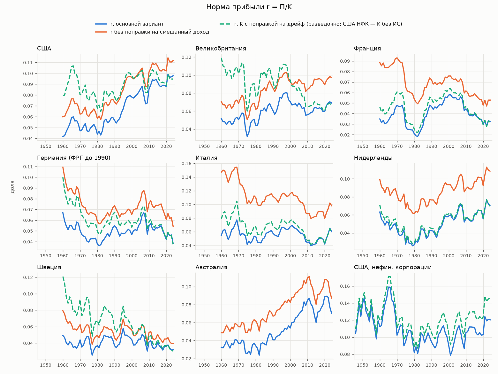
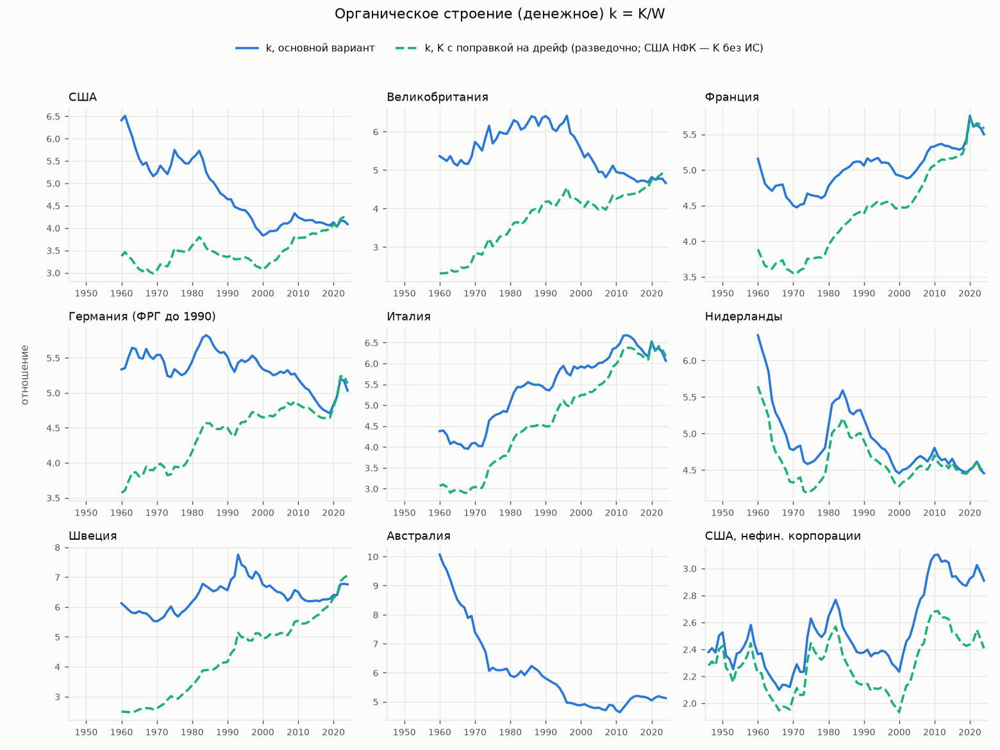

# Итерация 6: длинные ряды нормы прибыли и выравнивание нормы прибыли

* **Предрегистрация:** [`pre_registration_v6.md`](../pre_registration_v6.md), коммит 00580de — до расчётов.
* **Журнал отступлений** (п. 1–8) — там же. П. 8 — разведочные проверки по рецензии (§9). Каждая запись закоммичена отдельно от результатов, которых она касается.
* **Числа** — из [`results/v6/tables_v6.md`](../results/v6/tables_v6.md) (`python -m lts.v6.summary`) и CSV в `results/v6/`.
* **Рисунки** — `report/fig_v6/`.
* **Предыдущая итерация:** [`REPORT_v5.md`](REPORT_v5.md).

Метки статуса: **установлено / частично / не подтверждено / опровергнуто / неразличимо**. «М» — марксова гипотеза тенденции нормы прибыли к понижению из-за роста органического строения. Эмпирика и интерпретация разнесены; интерпретация — в подразделах «Как читать».

## 0. Резюме

| # | Вопрос | Результат | Статус для М |
|---|---|---|---|
| 1 | Видна ли в развитых странах за 1960–2024 та же картина, что в США НФК? (8 стран, AMECO, вся экономика) | По предрегистрированному основному варианту **ни в одной стране** нет устойчиво отрицательного тренда r_M (все 3 лага × 4 варианта концов). У AUS, GBR, USA тренд устойчиво **положительный** (с критическими значениями fixed-b — у AUS и USA). Панель по десятилетиям: β = +0,98 (p = 0,019); без эффектов периода +0,83 (p = 0,083). Исход по критериям — «против М». | **не подтверждено** |
| 2 | Надёжен ли этот исход? | **Нет.** Капитал AMECO дрейфует вниз относительно официальных запасов: против KLEMS на 7–31% за 1995–2021 во всех 7 проверенных странах, против BEA в США — с 1,44 до 0,71 за 1960–2024. Это смещает тренды r вверх. С поправкой на дрейф (разведочно): устойчиво отрицательный тренд у ITA и SWE, панель +1,23 (p = 0,17) — по правилу §3 это тоже «против М». Положительных нет, но AUS (в основном варианте «+») здесь выпадает: у неё нет эталона. Поправка переносит дрейф 1995–2021 на 1960–1994 — сильное допущение. | исход «против М» **ненадёжен** по уровню, но ни одна поправка не даёт «в пользу М» |
| 3 | (а) короткий горизонт | Длинный горизонт не дал того, чего не дал короткий. Из 7 стран, где сравнимо, отрицательный значимый тренд r_M за 1995–2021 у 4, а за 1960–2024 — ни у одной. | не подтверждено |
| 4 | (б) оценка капитала (историческая стоимость) | Зависит от построения. Метод с постоянной δ на США НФК даёт ложный отрицательный тренд r (p = 0,03–0,05) там, где официальная историческая стоимость BEA тренда не даёт (p ≈ 0,5); с переменной δ_t ложного тренда нет (§3.1). С δ_t устойчиво отрицательный тренд только у ITA, устойчиво положительный — у AUS, NLD, USA. Из 8 вариантов исторической стоимости по правилу §3 «промежуточно» дают 4 (δ × 0,7; начальный запас × 0,7; историческая амортизация; δ_t с запасом × 0,68), остальные — «против М». | **зависит от построения**; «в пользу М» — ни в одном варианте |
| 5 | (в) иностранный труд (разведочно) | Иностранная оплата труда в промежуточном импорте — 4–39% собственной (медиана 0,15). Расширенное k* даёт R² выше, чем k, в FIGARO (0,089 против 0,044), но оба незначимы (p_wild = 0,08 и 0,30); в WIOD — ничего. Учёт зарубежных доходов (ВНД) делает тренды r скорее выше, чем ниже. | неразличимо (данных мало) |
| 6 | США НФК 1951–2024 (контрольный ряд) | Тренд r отрицателен (p = 0,020 / 0,044 / 0,061 при лагах 2 / 4 / 8), r_M — незначим. Без ИС и при учёте полученных дивидендов и процентов тренда нет. Падение r_M 1951→2024 (−0,14 лог.) целиком за счёт k (e почти не изменилась), но сосредоточено в 1966–1982. Тренд r держится на начале 1951 г.: с 1958 или 1963 г. он незначим (p ≥ 0,20). | **частично**, как в итерации 5; зависит от начала ряда |
| 7 | Выравнивание нормы прибыли (этап 5) | Средние нормы по отраслям сходятся медленно и сохраняют различия десятилетиями. Инкрементальные «сходятся» мгновенно, но то же даёт симуляция, где прибыль каждой отрасли — независимый AR(1) без всякого выравнивания между отраслями (λ −0,16 против медианы симуляций −0,19). Авансированный капитал (основной + оборотный) объясняет распределение прибыли хуже выпуска (R² 0,12 против 0,45) и хуже 94–99% плацебо. | выравнивание на авансированный капитал **не подтверждено**; на новых вложениях — **неразличимо** от механики |

**Главное.**
1. На 50–65 годах восьми стран картины «M» нет: в основном варианте ни одна страна не показывает устойчивого падения r_M, три показывают рост.
2. Уровень трендов держится на капитале AMECO, который в последние десятилетия занижен. С поправками на капитал устойчиво отрицательных трендов 0–4 из 8, а у AUS и USA (в части вариантов и у NLD) рост остаётся. По правилу §3 большинство вариантов поправок — тоже «против М», 4 из 12 — «промежуточно», «в пользу М» — ни один (§3.1).
3. **Вывод о механизме тоже зависит от капитала.** В основном варианте там, где r_M падает, это в основном падение e. В вариантах исторической стоимости падение у DEU, FRA, SWE идёт в основном через k.
4. **Главный содержательный вывод итерации:** ответ на вопрос «падает ли норма прибыли за 60 лет» определяется в первую очередь **оценкой капитала** (переоценка запаса, историческая или восстановительная стоимость, сроки службы) и **поправкой на смешанный доход**, а не длиной ряда. Без согласованных официальных рядов запаса капитала в текущих ценах за 60 лет вопрос на этих данных не решается.

## 1. Данные и их ограничения по странам

| Страна | Период (основной) | Источник | Ограничения |
|---|---|---|---|
| USA, GBR, FRA, ITA, NLD, SWE, AUS | 1960–2024 | AMECO (весна 2026), вся экономика | K включает жильё и госсектор (разделить нельзя); K = реальный запас × дефлятор ВНОК — дрейф против официальных запасов (§2.3) |
| DEU | 1960–2024 | ФРГ 1960–1990 + Германия 1991–2024 | стык 1991 г.: r 0,0532 → 0,0530 (разрыв мал); у ФРГ нет PIGT — неявный дефлятор UIGT/OIGT, совпадающий с PIGT там, где есть оба |
| JPN | 1980–2024 (с поправкой) | AMECO | самозанятые только с 1980 г.; в основной критерий не входит |
| CAN | 1991–2024 | AMECO | CFC и чистый излишек только с 1991 г.; справочно |
| США НФК | 1946–2024 (основной 1951–2024) | NIPA T11400 + BEA Fixed Assets 4.1–4.6 (прислал пользователь) | часы НФК нет — для разложения Басу используются часы всей экономики |

* Национальные длинные ряды сектора НФК вне США не строились. Где их искать — в конце отчёта.
* Историческая стоимость вне США строится непрерывной инвентаризацией по ВНОК с 1960 г. Тесты — с 1975 г.; δ — медиана CFC / K (срок службы ≈ 2/δ).
* Поправка на смешанный доход: вменённая оплата самозанятых по средней оплате наёмного.

  В 1960 г. она велика: доля W_se в W — 40% в Италии, 28% во Франции, 16% в Австралии, 12% в США. К 2024 г. — 6–23%. **Поправка сама по себе меняет знак трендов:** без неё r_M устойчиво падает в ITA и JPN (65 лет), почти устойчиво — во FRA и SWE (11 из 12 спецификаций). С ней падения нет.

  Причина: в 1960-х большая доля «прибыли» без поправки — это доход крестьян и ремесленников, который исчезал вместе с ними.

## 2. Ряды и разложения

### 2.1 Рисунки

* `report/fig_v6/r.png` — r = Π/K: основной вариант, без поправки на смешанный доход, K с поправкой на дрейф.
* `report/fig_v6/rM.png` — r_M = Π/(K + W).
* `report/fig_v6/e.png` — норма эксплуатации e = Π/W.
* `report/fig_v6/k.png` — денежное органическое строение k = K/W.

### 2.2 Разложения за весь период (основной вариант; лог. изменения)

| Страна | r: 1960 → 2024 | Δ ln r_M | вклад e | вклад −(1+k) | k: 1960 → 2024 | e: 1960 → 2024 |
|---|---|---|---|---|---|---|
| USA | 0,042 → 0,098 | +0,78 | +0,40 | +0,38 | 6,41 → 4,09 | 0,27 → 0,40 |
| GBR | 0,051 → 0,069 | +0,27 | +0,15 | +0,12 | 5,36 → 4,67 | 0,28 → 0,32 |
| FRA | 0,035 → 0,033 | −0,06 | −0,01 | −0,05 | 5,16 → 5,50 | 0,18 → 0,18 |
| DEU | 0,067 → 0,038 | −0,57 | −0,62 | +0,05 | 5,34 → 5,03 | 0,36 → 0,19 |
| ITA | 0,055 → 0,060 | +0,15 | +0,42 | −0,27 | 4,38 → 6,06 | 0,24 → 0,37 |
| NLD | 0,063 → 0,070 | +0,05 | −0,25 | +0,30 | 6,35 → 4,46 | 0,40 → 0,31 |
| SWE | 0,049 → 0,032 | −0,42 | −0,34 | −0,09 | 6,12 → 6,76 | 0,30 → 0,22 |
| AUS | 0,033 → 0,070 | +0,69 | +0,10 | +0,59 | 10,07 → 5,13 | 0,33 → 0,36 |
| США НФК (1946–2024) | 0,105 → 0,120 | +0,20 | +0,34 | −0,15 | 2,38 → 2,91 | 0,25 → 0,35 |

* **Вайскопф:** доля прибыли объясняет 62–85% дисперсии годовых Δ ln r (медиана ~0,8), капиталоотдача — 6–21%.
* **Маркс:** дисперсия годовых Δ ln r_M почти целиком приходится на e (0,84–1,04).
* Из трёх стран, где r_M упала за весь период (DEU, FRA, SWE), в двух (DEU, SWE) падение объясняется в основном e, а не k. **Это зависит от капитала:** в вариантах исторической стоимости (1975–2024) у всех трёх падение идёт в основном через k, при поправке на дрейф — у 4 из 6 стран с падением (`decomp_full.csv`).

**Разложения по десятилетиям** (медианы по 8 странам основного варианта; `decomp_decades.csv`; исправлено по Р4 — в черновике были медианы по всем рядам, включая JPN, CAN и США НФК):

| Десятилетие | Δ ln r_M | вклад e | вклад −(1+k) | Δ ln(Q_K/H) | Δ ln(P_K/w) |
|---|---|---|---|---|---|
| 1960-е | +0,11 | 0,00 | +0,09 | (+0,45)* | (−0,57)* |
| 1970-е | −0,16 | −0,15 | −0,03 | +0,37 | −0,26 |
| 1980-е | +0,32 | +0,33 | −0,03 | +0,14 | −0,11 |
| 1990-е | +0,20 | +0,15 | +0,06 | +0,14 | −0,16 |
| 2000-е | −0,18 | −0,14 | −0,02 | +0,14 | −0,11 |
| 2010-е | −0,01 | 0,00 | +0,03 | +0,02 | −0,07 |

\* Часы в 1960-е есть только у Франции; в остальные десятилетия Басу — по 7 странам.

**Басу.** Техническое строение (реальный капитал на час) растёт в каждом десятилетии. Его почти целиком компенсирует удешевление капитала относительно зарплаты, так что денежное k меняется мало. Это та же противодействующая тенденция, что в итерации 5, теперь на горизонте 50 лет.

### 2.3 Капитал AMECO: дрейф

| Страна | K AMECO / официальный K: первый год | последний год | дрейф g (в год) | Эталон |
|---|---|---|---|---|
| USA | 1,44 (1960) | 0,71 (2024) | −1,05% | BEA FA 1.1, стр. 2 |
| GBR | 1,82 (1995) | 1,33 (2021) | −1,38% | KLEMS TOT |
| SWE | 1,47 | 1,01 | −1,47% | KLEMS |
| DEU | 0,99 | 0,85 | −0,66% | KLEMS |
| ITA | 1,11 | 0,95 | −0,58% | KLEMS |
| FRA | 1,05 | 0,90 | −0,46% | KLEMS |
| NLD | 0,97 | 0,90 | −0,19% | KLEMS |
| AUS | — | — | — | эталона нет |

Вероятная причина: весь реальный запас переоценивается дефлятором *потока* инвестиций, где растёт доля дешевеющего оборудования и ИКТ, тогда как в запасе преобладают сооружения. Для США замена K на BEA FA меняет r за 1960–2024 с «рост с 0,042 до 0,098» на «рост с 0,060 до 0,070». Тренд r при лаге 4 перестаёт быть значимым (p = 0,12); r_M остаётся слабо положительным (p = 0,04).

* **Природа дрейфа** (проверка рецензента, Р9): за 1995–2021 расхождение AMECO с KLEMS у DEU, ITA, NLD, SWE, GBR — в основном ценовое (дефлятор), что подтверждает объяснение выше. У FRA и USA ценовая часть (−0,55 и −0,48) частично гасится объёмной (+0,39 и +0,17) — объёмы KLEMS там сомнительны.
* KLEMS — не вполне «официальные» запасы: часть стран построена собственной непрерывной инвентаризацией KLEMS. Разрывы уровней в 1995 г. (GBR 1,82, SWE 1,47) говорят о различиях определений.
* Вариант `kdrift` переносит наклон 1995–2021 на 1960–1994. Для USA он даёт r 0,080 → 0,095, а BEA — 0,060 → 0,070: экстраполяция неточна даже там, где её можно проверить.

## 3. Тесты

### 3.1 T1: тренды (основной вариант; наклон в год, p при лагах 2 / 4 / 8)

| Страна | r_M | Устойчиво (все лаги × концы) |
|---|---|---|
| USA | +0,0007 (p < 0,001 при всех лагах) | **положительный** |
| GBR | +0,0003 (0,000 / 0,000 / 0,001) | **положительный** |
| AUS | +0,0007 (0,000 при всех) | **положительный** |
| NLD | +0,0003 (0,001 / 0,007 / 0,020) | нет (при сдвиге концов) |
| FRA | +0,0001 (0,13 / 0,21 / 0,28) | нет |
| DEU, ITA, SWE | ≈ 0 (p ≥ 0,40) | нет |

**Все варианты по правилу §3** (`rc_variants.csv`, `rc_fixedb.csv`; переделано по Р1). «Устойчиво» — все 3 лага × 4 варианта концов. «e > k» — у скольких стран с падением r_M за весь период |вклад e| > |вклад k|. Панель T3 считалась только для основного, без поправки, исторической стоимости и дрейфа; везде β ≥ 0 и незначима или положительна, так что условие панели в «против М» выполнено.

| Вариант | Устойчиво − | Устойчиво + | Страны с падением r_M; e > k | Исход по правилу §3 | Fixed-b: − / + |
|---|---|---|---|---|---|
| **основной** (предрег.) | 0 | AUS, GBR, USA | DEU, FRA, SWE; 2 из 3 | против М | — / AUS, USA |
| без поправки на смешанный доход (предрег.) | ITA | AUS, GBR, USA | DEU, FRA, ITA, SWE; 4 из 4 | против М | ITA / AUS, GBR, USA |
| поправка × 0,5 (разв., Р8) | ITA | AUS, GBR, USA | 3 из 4 | против М | — / AUS, GBR, USA |
| ист. стоимость, 1975–2024 (предрег.) | ITA | AUS, USA | DEU, FRA, SWE; 0 из 3 | против М | — / AUS, USA |
| … δ × 0,7 | DEU, GBR, ITA, SWE | AUS, USA | 0 из 3 | промежуточно | — / AUS |
| … δ × 1,3 | — | AUS, NLD, USA | 1 из 3 | против М | — / AUS, NLD, USA |
| … начальный запас × 0,7 | DEU, GBR, ITA, SWE | AUS, USA | 0 из 3 | промежуточно | — / AUS, USA |
| … начальный запас × 1,3 | ITA | AUS, NLD, USA | 1 из 3 | против М | — / AUS, USA |
| … с исторической амортизацией | GBR, ITA, SWE | — | FRA, ITA, SWE; 0 из 3 | промежуточно | GBR, ITA / — |
| … переменная δ_t (разв., Р2) | ITA | AUS, NLD, USA | 2 из 3 | против М | — / AUS, NLD, USA |
| … δ_t, начальный запас × 0,68 (разв.) | GBR, ITA, SWE | AUS, NLD, USA | 1 из 3 | промежуточно | — / AUS, NLD, USA |
| поправка на дрейф K (разв., 7 стран) | ITA, SWE | — | 6 стран; 2 из 6 | против М | SWE / — |

* «В пользу М» (≥ 5 из 8) не даёт ни один вариант.
* США: BEA K вместо AMECO — устойчивого тренда нет.
* США НФК: устойчиво отрицательного тренда r_M нет ни в одном варианте (основной: 5 из 18 спецификаций значимо отрицательны; историческая стоимость: 12 из 18; с исторической амортизацией: 15 из 18).

**Проверка метода исторической стоимости на США НФК** (Р2; `rc_pim_usnfc.csv`). Тот же алгоритм по инвестициям BEA FA 4.7 против официальной BEA 4.3:

| Построение | Запас / BEA 4.3: 1975 | 1995 | 2024 | Тренд r 1975–2024, p при лагах 2 / 4 / 8 |
|---|---|---|---|---|
| **официальная BEA 4.3** | 1 | 1 | 1 | −0,0002 (0,51 / 0,54 / 0,55) |
| постоянная δ (как `hc`) | 1,06 | 1,13 | 1,21 | −0,0006 (**0,026 / 0,043** / 0,053) |
| постоянная δ, запас × 0,68 | 1,02 | 1,12 | 1,21 | −0,0007 (**0,020 / 0,036 / 0,046**) |
| переменная δ_t | 1,12 | 1,13 | 1,16 | −0,0003 (0,21 / 0,26 / 0,27) |
| δ_t, запас × 0,68 | 1,07 | 1,13 | 1,16 | −0,0004 (0,15 / 0,19 / 0,21) |

Постоянная δ при растущей фактической норме выбытия занижает амортизацию в конце периода, и запас к концу завышается. На данных, где официальная историческая стоимость тренда не даёт, этот метод **создаёт** значимый отрицательный тренд. С δ_t ложного тренда нет. Поэтому варианты `hc`, `hc_d07`, `hc_i07` смещены в сторону М, а `hc_dt` — лучшее из доступных построений.

**Fixed-b** (Р12). NW с лагами ≤ 8 на 50–65 наблюдениях персистентных рядов занижает p. С критическими значениями Kiefer–Vogelsang (2005) устойчиво отрицательных трендов почти не остаётся (последний столбец). Положительные AUS и USA устойчивы и к этому. GBR в основном варианте теряет устойчивость (значим в 11 из 12 спецификаций).

### 3.2 T2: разрывы

* **Bai–Perron (LWZ):** у большинства стран 1–3 разрыва. Даты концентрируются около 1974–1975, 1981–1986, 1994–1995, 2005–2009.
* **Разрыв в окне 1970–1982** (sup-F, AR(1)-бутстреп): значим только у NLD (1981, p = 0,005–0,007). У США НФК — 1970 (p = 0,057–0,061), у AUS — 1974 (p = 0,054–0,090).

* В вариантах исторической стоимости окно (фактически 1978–1982, ряды с 1975 г.) даёт значимый разрыв 1982 г. у GBR (p = 0,001), ITA (0,009), SWE (0,005) — Р12.
* Bai–Perron игнорирует автокорреляцию остатков, так что возможен лишний разрыв.

В основном варианте разрыв около 1970–1982 не является общим для всех.

### 3.3 T3: панель страна × десятилетие (Δ ln r_M на Δ ln(1 + k))

| Спецификация | β | p (wild bootstrap; 8 кластеров, у дрейфа 7, у + JPN 9) |
|---|---|---|
| **эффекты страны и периода, без цикла (основная)** | **+0,98** | **0,019** |
| … с циклом (HP) | +0,99 | 0,018 |
| … с циклом (разрыв AMECO) | +0,97 | 0,040 |
| только эффекты страны | +0,83 | 0,083 |
| пятилетия, эффекты страны и периода | +0,53 | 0,11 |
| без поправки на смешанный доход | +0,35 | 0,35 |
| историческая стоимость (1975–2024) | +0,61 | 0,41 |
| поправка на дрейф K (разведочно) | +1,23 | 0,17 |
| + JPN без поправки | +0,07 | 0,78 |

* В спецификациях по десятилетиям знак везде положительный. В пятилетиях встречаются отрицательные β: + JPN без поправки (−0,12…−0,30) и историческая стоимость (−0,01…−0,09), все незначимы (p ≥ 0,5).
* При 7–9 кластерах p-значения грубые. Расхождение t_CR1 и p_wild у дрейфа (t = 3,28, p_wild = 0,17) — признак проблемы малого числа кластеров.

**Что значит знак β** (Р6; разведочно, `rc_t3_mech.csv`). Так как r_M = e / (1 + k), без контроля e оценка β = (наклон Δ ln e на Δ ln(1 + k)) − 1. β ≈ +1 значит, что e и k движутся вместе сильнее, чем один к одному: корреляция Δ ln e и Δ ln(1 + k) по десятилетиям — 0,46. Естественный источник — общий знаменатель W: колебания доли зарплаты двигают e = Π/W и k = K/W в одну сторону. Положительный β поэтому мало говорит против М.

Проверка с другим регрессором: Δ ln r_M на Δ ln(K/Y) без контролей — β = +0,10 (p = 0,83); только эффекты страны — −0,70 (p = 0,19). С контролем Δ ln(Π/Y) β = −0,85 (p < 0,001), но это почти тождество (r_M = (Π/Y) / ((K + W)/Y)) и о М ничего не говорит. Капиталоёмкость по отношению к выпуску с изменением r_M по десятилетиям не связана.

### 3.4 T4: сравнение с итерацией 5

* За 1995–2021 ряды r AMECO и основного агрегата KLEMS итерации 5 коррелируют по уровню на 0,74–0,98 у 6 стран. Исключение — USA (0,07): у AMECO там вся экономика и дрейфующий K.
* Тренд r_M за 1995–2021 по AMECO отрицателен и значим у FRA, ITA, SWE, GBR (4 из 7) и положителен у NLD, USA.
* За 1960–2024 отрицательного значимого тренда нет ни у одной из этих стран.

Длинный горизонт не усиливает, а **размывает** падение: 1995–2021 — отрезок снижения после пика конца 1990-х.

### 3.5 Итог по предрегистрированным критериям

* **Основной вариант:** 0 из 8 устойчиво отрицательных трендов; 3 устойчиво положительных; из стран с падением r_M вклад e больше вклада k у 2 из 3; панель положительна. Формально — **«против М»**.
* Но уровень трендов держится на капитале AMECO, дрейф которого вскрылся после первых результатов (журнал п. 4). С поправками на капитал — 0–4 устойчиво отрицательных тренда из 8. Устойчиво положительные остаются во всех вариантах исторической стоимости, кроме варианта с исторической амортизацией (AUS, USA; в части вариантов NLD). По тому же правилу 8 из 12 вариантов — «против М», 4 — «промежуточно», ни один — «в пользу М» (таблица §3.1; исправлено по Р1: в черновике было «положительных нет» и «ближе к промежуточно»).

**Итог итерации: «не подтверждено».** В основном варианте — «против М». Результат не устойчив к оценке капитала в обе стороны: и знак трендов отдельных стран, и роль k против e зависят от способа оценки K. Надёжный официальный ряд есть только для США НФК, а там тренд r отрицателен лишь при начале 1951 г.

### 3.6 Как читать (интерпретация)

1. **Объяснение (а), короткий горизонт, не подтверждается.** Горизонт 65 лет не показывает падения там, где его не показали 27 лет. В 1995–2021 падение даже заметнее: это фаза, а не тренд.
2. **Объяснение (б), оценка капитала, — не подтверждено на доступных данных.** Устойчиво отрицательные тренды у 3–4 стран появляются только в 4 из 8 вариантов исторической стоимости. Притом метод с постоянной δ, проверенный на США НФК, сам создаёт ложный отрицательный тренд. Лучшее построение (переменная δ_t) даёт один отрицательный тренд (ITA) и три положительных. Аргумент Kliman (историческая стоимость падает там, где восстановительная — нет) здесь проверяем только на США НФК по официальным данным BEA: там при исторической стоимости тренд r_M значимо отрицателен в 12 из 18 спецификаций, но не устойчиво. Без официальных рядов исторической стоимости вне США вывод не делается.
3. **Поправка на смешанный доход** — второй по силе фактор, и он работает против М. Без неё «падение нормы прибыли» в Италии, Японии, Франции во многом — это исчезновение мелкого производства.
4. **В основном варианте там, где r_M падает, это чаще падение e (распределение), а не рост k.** Этот вывод держится на том же капитале AMECO: в вариантах исторической стоимости падение идёт в основном через k. Устойчиво (на любом капитале) только то, что рост технического строения в основном компенсируется удешевлением капитала (Басу).
5. **Положительный β панели T3 — скорее механика общего знаменателя W**, чем свидетельство против М (§3.3).

## 4. США НФК: подробно

* r 1951–2024: 0,146 → 0,120. Тренд −0,0003 в год (p = 0,020 / 0,044 / 0,061).
* r_M: p = 0,15 / 0,22 / 0,27.
* Без ИС в капитале: тренд r незначим ни при каком лаге. Историческая стоимость (BEA 4.3): отрицательный тренд r устойчив, r_M — в 12 из 18 спецификаций.
* Разложение: Δ ln r_M 1951→2024 = −0,14; вклад e = +0,02, вклад k = −0,15. Но по подпериодам:
  * 1966–1982: −0,59 (e −0,40; k −0,20);
  * 1982–2007: +0,27;
  * 2007–2024: +0,14.
* Картина «e постоянна, k растёт» верна только для концов ряда. Внутри ряда движение определяется e.
* **Начало ряда** (Р5; `rc_s53_1958.csv`). Отрицательный тренд r держится на начале 1951 г.: с 1946 г. он значим во всех 6 спецификациях, с 1951 г. — в 5 из 6, с 1956 г. — в 1. С 1958 г. p = 0,20 / 0,27 / 0,32, с 1963 г. — 0,31 / 0,39 / 0,44. Это 1951–1957 гг. с высокой нормой прибыли после войны и Корейской войны.

## 5. Этап 4 (разведочный): мировой труд за корпоративной прибылью

### 5.1 ВВП- и ВНД-представление

Прибавление чистых первичных доходов из-за рубежа (AMECO UBRA; для США НФК — NIPA B645RC − A655RC):
* **не делает** тренды r более отрицательными;
* у FRA и SWE тренд r становится **положительным** и значимым (p = 0,034 / 0,042 при лаге 4), у DEU — на грани (0,051; при лаге 8 — 0,094);
* у США НФК отрицательный тренд ослабевает (p = 0,044 → 0,082). Это грубо: к прибыли НФК прибавляются **все** национальные чистые первичные доходы из-за рубежа, включая доходы государства и домохозяйств (журнал п. 6). Проверка — корпоративная прибыль из-за рубежа (`gni_corp`, только 1998–2024): тренд r **положительный**, +0,0012 в год (p < 0,001).
* В `trends*.csv` и `criteria.md` до рецензии строки `USA_NFC, gni` были от старого определения (корпоративная, 1998–2024), посчитанного до записи журнала п. 6. Исправлено перезапуском; на отчёт это не влияло (Р3).

Чистые доходы из-за рубежа в последние десятилетия растут. Это дополнительная прибыль, а не поправка к падению.

### 5.2 Иностранный труд в промежуточном импорте

* **ω** = иностранная оплата труда, воплощённая в промежуточном импорте (по ставкам стран-поставщиков), / собственная оплата труда.
  * Медиана 0,157 (FIGARO 2010–2024) и 0,144 (WIOD 2000–2014).
  * От 0,04–0,06 (США, Япония) до 0,33–0,39 (Нидерланды).
  * Растёт у большинства стран (внутри FIGARO 2010–2024: Италия 0,20 → 0,23, Япония 0,06 → 0,11, Нидерланды 0,22 → 0,33; внутри WIOD 2000–2014: 0,18 → 0,18, 0,04 → 0,11, 0,23 → 0,34).
  * У остального мира FIGARO (WRL_REST) оплата труда D1 есть (18,8% выпуска в 2015 г.), так что ω из-за этого не занижена (Р11).
* **Панель** (годовые разности, эффекты страны и года, 8 кластеров):
  * FIGARO: Δ ln(1 + k) β = −1,23 (p = 0,30, R² 0,044); Δ ln(1 + k*) β = −1,71 (p = 0,081, R² 0,089);
  * WIOD: оба незначимы (R² ≤ 0,003).
* **Итог:** у k* R² выше, чем у k, в одном источнике из двух, но ни тот ни другой незначим — «объясняет лучше» сказать нельзя. В панели r_M не расширена (Π/(K + W)), а k* расширено. Периоды 14–15 лет — слишком коротко для вывода. По предрегистрации этап разведочный.

## 6. Этап 5: выравнивание нормы прибыли

### 6.1 Авансированный капитал (панель KLEMS итерации 4, 2000–2021)

Доля прибыли отрасли в стране-году против долей источника; R² «чистой пропорциональности», медиана по 592 странам-годам, 12 573 наблюдения:

| Источник | R² | λ-модель итерации 4 с конкурентом K: λ |
|---|---|---|
| основной капитал K | 0,00 | — |
| K_adv, τ = 0,1 | 0,05 | −11,8 |
| K_adv, τ = 0,127 (США: запасы / издержки) | 0,06 | −9,5 |
| **K_adv, τ = 0,25 (основной)** | **0,12** | −5,2 |
| K_adv, τ = 0,5 | 0,19 | −3,0 |
| затраты на труд W | 0,25 | −1,1 |
| издержки II + W + CFC (тривиальный эталон) | 0,34 | −0,9 |
| **выпуск GO** | **0,45** | 0,01 |

* **λ** — вес источника в модели итерации 4 π_j = λ·s_j + (1 − λ)·s_K,j. Значения вне [0, 1] — это не веса: λ < 0 значит, что модель «отталкивается» от источника в сторону K. Столбец показывает только направление (Р13).
* **Плацебо для K_adv (τ = 0,25):** плацебо — это GO × шум той же дисперсии, что у K_adv / GO. R² не ниже, чем у K_adv, у 94% перестановок и у 99% лог-нормальных коэффициентов. Это значит, что отклонение K_adv от GO **отрицательно** связано с отклонением Π от GO: капиталоёмкие отрасли получают меньше прибыли на единицу выпуска, чем «положено» по K_adv. Фраза черновика «хуже случайного вектора» была неточной (Р13).
* GO содержит Π по определению, отсюда часть механического преимущества эталона «выпуск». Отбор |r| ≤ 2 (итерация 4) — это отбор по отношению к K.
* **Критерий:** R²(K_adv, τ = 0,25) = 0,12 < 0,45 − 0,02. «Пропорционально выпуску» **несовместимо** с выравниванием нормы прибыли на авансированный капитал в этих данных.
* Чем больше оборотная часть, тем ближе K_adv к издержкам и тем выше R², но даже чистые издержки (0,34) не достигают выпуска (0,45).
* **Оговорка:** запасов по отраслям нет, τ задан вариантами. Отраслевые различия в скорости оборота (торговля против тяжёлой промышленности) могли бы изменить результат, но для этого нужны отраслевые данные о запасах.

### 6.2 Инкрементальные нормы (Шейх); панель KLEMS 1995–2021, 575 отраслей-стран

| Мера | медиана SD между отраслями | λ (AR(1), эффекты отрасли) | полураспад, лет | λ без эффектов | полураспад | доля отраслей со значимым долгосрочным отклонением (без поправки / Холм) |
|---|---|---|---|---|---|---|
| средняя r = Π/K_{t−1} | 0,149 | 0,72 | 2,1 | 0,89 | 5,9 | 49% / 28% |
| инкрементальная ΔΠ / I_{t−1} | 0,393 | −0,16 | < 1 | −0,12 | < 1 | 7,5% / 0,3% |
| инкрементальная, лаг 2 | 0,269 | 0,24 | 0,5 | 0,27 | 0,5 | 4,5% / 0,2% |
| **плацебо: ΔΠ переставлены между отраслями** | 0,911 | **−0,30** | < 1 | −0,12 | < 1 | 18% / 0,3% |

* **Устойчивость различий средних норм:** корреляция средней r отрасли за 1996–2005 и 2011–2021 внутри страны — 0,54 (Спирмен 0,62; 575 отраслей).
* **Критерий** (предрегистрация §5.2):
  * (i) полураспад r_inc меньше половины полураспада r — да;
  * (ii) значимых LR у r_inc ≤ 10%, у r ≥ 30% — да (7,5% и 49%);
  * (iii) r_inc сходится быстрее плацебо — **неоднозначно** (исправлено по Р7; в черновике было «нет»). При λ < 0 «скорость» предрегистрацией не задана.
    * По обычной мере затухания |λ| отклонение r_inc (|λ| = 0,16) затухает **быстрее**, чем у плацебо (0,30). Тогда выполнены все три условия, и формально выходит «в пользу Шейха».
    * Но сравнение зависит от оценщика: по медиане λ_j по отраслям (`s5_2_mueller.csv`) — −0,13 у r_inc против −0,04 у плацебо (обратный порядок); без эффектов отрасли оба −0,12.
    * Перестановка ΔΠ между отраслями разрушает как раз ту внутриотраслевую структуру, которую мы называем механикой, так что это плацебо — слабый эталон.

  **Симуляционное плацебо** (разведочно, журнал п. 8д; `rc_s52_sim.csv`). Прибыль каждой отрасли — независимый AR(1) в уровнях со своими параметрами и фактическими инвестициями; никакого выравнивания норм между отраслями в модели нет. 50 повторов дают λ(r_inc) с медианой −0,19 (5–95%: −0,48 … −0,12); фактическое −0,16 — внутри (64% симуляций ниже). Простая формула: если Π_j — AR(1) с ρ ≈ 0,72, автокорреляция ΔΠ ≈ −(1 − ρ)/2 ≈ −0,14.

  Исход: формально — между «промежуточно» и «в пользу Шейха», в зависимости от прочтения (iii). По существу — **неразличимо от механики**: «мгновенная сходимость» инкрементальных норм полностью воспроизводится моделью без выравнивания.
* **Прочее** (Р7): у r_inc SD в 2,6 раза выше, чем у r, поэтому критерий (ii) механически благоприятен шумной мере (ниже мощность). Дельта-метод для долгосрочного отклонения при λ_j > 0,9 (12,5% отраслей для r) ненадёжен. Период устойчивости «1996–2005» вместо предрегистрированного 1995–2005 — вынужденно (r требует K_{t−1}).

### 6.3 Финансовые доходы (США)

| Ряд | Период | тренд r, p при лагах 2 / 4 / 8 | Δ ln r_M: вклад e / вклад k |
|---|---|---|---|
| НФК (основной) | 1951–2024 | 0,020 / 0,044 / 0,061 | +0,02 / −0,15 |
| НФК + полученные дивиденды и проценты | 1958–2024 | 0,32 / 0,36 / 0,33 | +0,35 / −0,09 |
| Все корпорации (с финансовыми) | 1951–2024 | 0,091 / 0,15 / 0,20 | +0,11 / −0,15 |

**Переписано по Р5.**
* **Начало ряда.** Основной ряд НФК с того же 1958 г. тоже не имеет тренда (p = 0,20 / 0,27 / 0,32; `rc_s53_1958.csv`). Значит, «исчезновение тренда с финансовыми доходами» целиком — эффект начала ряда, а не финансовых доходов. Сравнение при общем начале ничего не показывает.
* **Двойной счёт.** Складываются валовые полученные проценты и дивиденды. Потоки между самими НФК уже сидят в NOS плательщика и прибавляются второй раз как доход получателя. Чистых доходов от собственности извне сектора мы не строили (нужен FoF Z.1 по контрагентам).
* **Числитель и знаменатель не согласованы.** Финансовые доходы — доход на финансовые активы, которых нет в K. Их отношение к NOS — от 0,15 (1958) до 0,49 (1990) и 0,18 (2024).
* Коды NIPA проверены рецензентом и верны; NOS НФК действительно не содержит доходов от собственности.
* У всех корпораций (1951–2024) тренд незначим.

Итог 5.3: **неинформативно** в нынешнем построении.

## 7. Что это не доказывает

* **Не доказывает отсутствия тенденции нормы прибыли к понижению.** Ряды вся экономика, с жильём и госсектором, с капиталом, переоценённым дефлятором потока. Главный результат определяется оценкой капитала, а она ненадёжна.
* **Не доказывает, что историческая стоимость «правильная»:** её результат зависит от сроков службы, которые мы задали сами.
* **Этап 4 не проверяет «перенос стоимости» из стран-поставщиков:** ω — это оплата труда, а не стоимость; выборка коротка.
* **Этап 5 не решает вопроса о выравнивании.** Инкрементальные нормы по построению шумны и быстро возвращаются к среднему, так что «Шейх» и «механика» на этих данных неразличимы.
* **Метод исторической стоимости вне США не проверен на официальных данных.** На США НФК вариант с постоянной δ даёт ложный отрицательный тренд; вывод зависит от δ и начального запаса (Р2).
* **Вывод «падение r_M — через e, а не k» не устойчив** к оценке капитала (Р1).
* **Тренд r США НФК зависит от начала 1951 г.** (Р5).
* **Поправка на дрейф экстраполирует** наклон 1995–2021 на 35 лет назад (Р9).
* **Поправка на смешанный доход** приписывает самозанятым среднюю оплату наёмного (Gollin, 2002: это завышает трудовую часть там, где самозанятые менее производительны). Промежуточный вариант × 0,5 даёт тот же итог, что основной (§3.1), но истинная доля неизвестна (Р8).
* **Вся экономика включает государственный капитал** с нулевым NOS; изменение его доли в K сдвигает r (Р8).
* **Трендовые p занижены** при сильной персистентности; fixed-b снимает почти все устойчиво отрицательные тренды и GBR из положительных (Р12).

## 8. Чего не хватает (данные)

* **Официальные ряды чистого запаса основного капитала в текущих ценах (и, где есть, по исторической стоимости) по сектору нефинансовых корпораций, 1960+**, для стран вне США. Это устранило бы главный источник неопределённости (§2.3). Где они публикуются:
  * ONS (Великобритания): «Capital stocks and fixed capital consumption»;
  * INSEE (Франция): comptes de patrimoine, S11;
  * Destatis (Германия): Vermögensbilanzen;
  * ESRI Cabinet Office (Япония): stock accounts;
  * Statistics Canada: таблица 36-10-0096 и национальный баланс;
  * ABS (Австралия): 5204.0;
  * CBS (Нидерланды).

  Длинные ряды там обычно — отдельные архивные таблицы.
* OECD ICIO 1995–2020 (403 здесь) — удлинил бы этап 4 до 26 лет.

## 9. Замечания независимого рецензента и ответы

Рецензия — [`results/v6/review_independent.md`](../results/v6/review_independent.md) (рецензент не менял код; 14 замечаний, сверено 40+ чисел, около 40 из 45 совпали). Разведочные проверки по рецензии заявлены в журнале п. 8 до расчёта; код — `src/lts/v6/review_checks.py`, результаты — `results/v6/rc_*.csv`.

| № | Замечание | Ответ |
|---|---|---|
| Р1 (критично) | «С поправками ближе к промежуточно» и «положительных нет» не следуют из правила §3; вывод «e, а не k» не устойчив к капиталу | **Принято.** В §3.1 — таблица всех 12 вариантов с исходом по правилу: 8 «против М», 4 «промежуточно», 0 «в пользу М». Формулировки в §0, §3.5 исправлены; оговорка о механизме — в §0, §2.2, §3.6, §7. |
| Р2 (критично) | Историческая стоимость с постоянной δ смещена; на США НФК метод даёт ложный тренд; объяснение (б) преувеличено | **Принято и воспроизведено.** На США НФК постоянная δ даёт p = 0,026 / 0,043 / 0,053 против 0,51–0,55 у BEA 4.3; переменная δ_t — 0,21–0,27. Добавлены `hc_dt`, `hc_dt_i068`; показаны `hc_i07`, `hc_i13`, `hc_hcdep`. Объяснение (б) понижено до «не подтверждено на доступных данных» (§3.6 п. 2, §0 стр. 4). |
| Р3 | Устаревшие строки `USA_NFC, gni`; определение сменено после расчёта, это не раскрыто | **Принято.** Тесты и сводка перезапущены; в журнале п. 8 раскрыто, что старое определение было посчитано до записи п. 6. `gni_corp` показан в §5.1. |
| Р4 | Таблица по десятилетиям — не по 8 странам; «8 кластеров»; «ни одного отрицательного β»; «5–35%»; DEU «значим»; Италия склеена из двух источников | **Принято**, всё исправлено (§2.2, §3.3, §0, §5.1, §5.2). |
| Р5 | 5.3: исчезновение тренда — целиком эффект начала; двойной счёт; несогласованность с K | **Принято.** С 1958 г. основной ряд тоже без тренда; §6.3 переписан, итог — «неинформативно». В §0 и §4 добавлено, что тренд r НФК держится на начале 1951 г. Чистые доходы извне сектора не строились (нужны данные Z.1 по контрагентам). |
| Р6 | Положительный β T3, вероятно, механический (общий знаменатель W); мало кластеров | **Принято.** Объяснение — в §3.3 и §3.6 п. 5; регрессия на Δ ln(K/Y): связи нет (β = +0,10, p = 0,83), с контролем Δ ln(Π/Y) — почти тождество. |
| Р7 | Критерий (iii) не определён при λ < 0; при \|λ\| — «в пользу Шейха»; плацебо не бьёт в механику | **Принято частично.** Неоднозначность раскрыта в §6.2. Формально при \|λ\| — «в пользу Шейха», это написано. Добавлено симуляционное плацебо без выравнивания: фактическое λ внутри его распределения. Поэтому по существу — «неразличимо от механики». |
| Р8 | Поправка на смешанный доход — полная импутация; нужен промежуточный вариант; госсектор | **Принято частично.** Добавлен `mi_half` (× 0,5): ITA устойчиво «−», AUS, GBR, USA «+», исход «против М» — как в основном. Пропорциональное деление по доле труда в корпоративном секторе не делалось: нет длинных рядов сектора по странам. Оговорки — в §7. |
| Р9 | Дрейф диагностирован верно (ценовой); kdrift — сильная экстраполяция; KLEMS не вполне официальны | **Принято.** Разложение рецензента и оговорки — в §2.3; экстраполяция названа в §0. |
| Р10 | Git подтверждает только порядок коммитов | **Согласны**; это ограничение всей процедуры предрегистрации в этом проекте. |
| Р11 | Этап 4: D1 у WRL_REST; формулировка про k*; грубость ВНД-варианта США | **Принято.** D1 у WRL_REST есть (18,8% выпуска); формулировка смягчена (§0, §5.2); грубость ВНД-варианта раскрыта в §5.1. |
| Р12 | NW-p занижены; Bai–Perron без автокорреляции; §3.2 неполон | **Принято.** Fixed-b (Kiefer–Vogelsang) для всех вариантов — в §3.1: устойчиво «−» почти исчезают, AUS и USA «+» остаются, GBR теряет устойчивость. Разрывы 1982 г. в вариантах hc — в §3.2. Perron–Yabu не делался. |
| Р13 | 5.1: GO содержит Π; λ вне [0, 1]; трактовка плацебо; отбор \|r\| ≤ 2 | **Принято**, §6.1. |
| Р14 | Дополнить «Что это не доказывает» | **Принято**, §7. |

**Что изменилось в выводах после рецензии.**
* Итог «не подтверждено» сохраняется.
* Сняты утверждения, что поправки на капитал сдвигают исход к «промежуточно» и что историческая стоимость — «самое сильное» объяснение.
* Вывод о механизме (e против k) помечен как зависящий от капитала.
* 5.2 — «неразличимо от механики» (усилено симуляцией).
* 5.3 — «неинформативно».

## Файлы

* **Код:** `src/lts/v6/`
  * `series.py` — ряды;
  * `tests.py` — этапы 2–3;
  * `stage4.py`, `stage5.py` — этапы 4 и 5;
  * `charts.py` — рисунки;
  * `summary.py` — таблицы;
  * `review_checks.py` — проверки по рецензии (журнал п. 8).
* **Результаты:** `results/v6/`.
